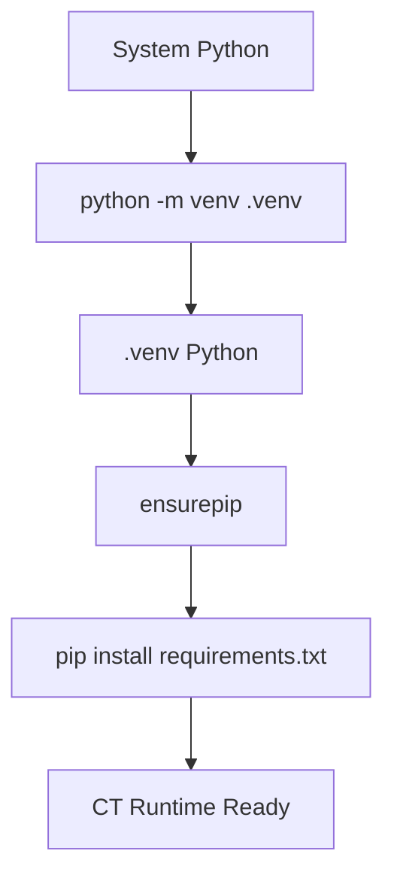
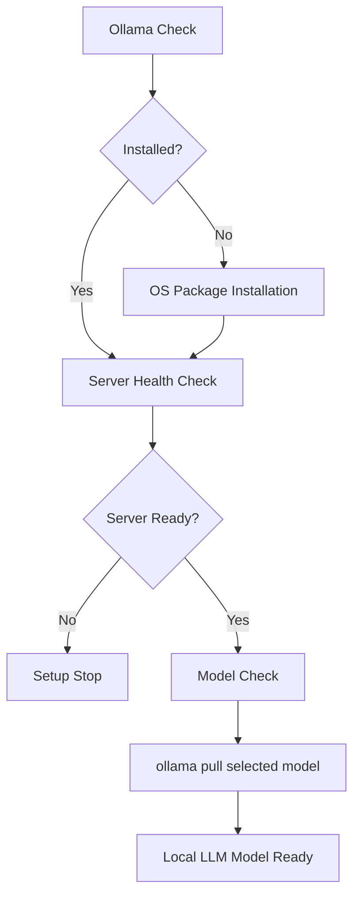
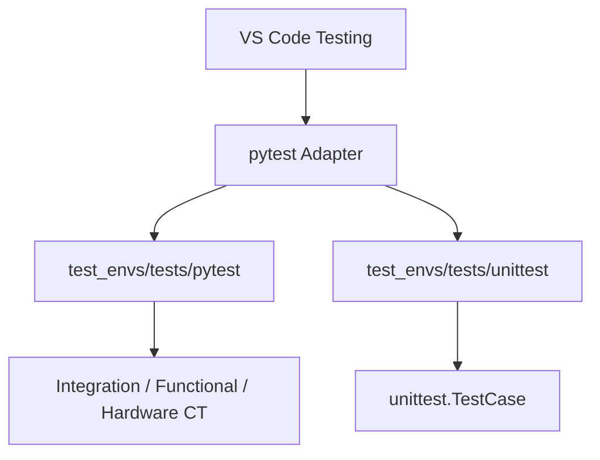

# 환경 구성

## 1. CT 환경 구성 — Python

### 구성 요소

| 항목 | 구성 |
|---|---|
| Runtime | Python project-local virtual environment |
| Virtual environment | `.venv` |
| Dependency manifest | `requirements.txt` |
| Unit test | `unittest` |
| Continuous test | `pytest` |
| Hardware libraries | `pyserial`, `pyusb` |
| Report tools | MkDocs, Pandoc integration |

### 설치 흐름



### 실행 경로

```text
.venv/
└── Scripts/
    ├── python.exe
    ├── pytest.exe
    ├── mkdocs.exe
    └── pip.exe
```

### VS Code 실행

| 항목 | 값 |
|---|---|
| Run and Debug | `SETUP 2: Install Python Virtual Environment` |
| Task | `SETUP 2: Install Python Virtual Environment` |
| Setup module | `python -m test_envs.tools.environment_setup python` |

## 2. Ollama 환경 구성

### 구성 요소

| 항목 | 구성 |
|---|---|
| Local LLM runtime | Ollama |
| Primary model | `test_envs/configs/config.json` / `OLLAMA_MODEL` |
| Default endpoint | `http://127.0.0.1:11434` |
| Endpoint variable | `OLLAMA_URL` |
| Model variable | `OLLAMA_MODEL` |
| Project config | `test_envs/configs/config.json` |
| Environment check | `test_envs/configs/check.json` |
| Model selection | `ollama.selected_model` |
| Installed inventory | `python -m test_envs.tools.configuration check` |
| Offline fallback | Deterministic analyzer |
| Escalation | Codex |

### 설치 흐름



### OS 설치 방식

| OS | Installer |
|---|---|
| Windows | `winget install Ollama.Ollama` |
| macOS | `brew install ollama` |
| Linux | Ollama official installer |

### 플랫폼 선택

| 선택값 | 동작 |
|---|---|
| `auto` | 현재 운영체제 자동 감지 |
| `config` | `test_envs/configs/config.json` / `os` |
| `windows` | Windows + winget |
| `linux` | Linux + official installer |
| `macos` | macOS + Homebrew |

| 항목 | 값 |
|---|---|
| VS Code input | `targetOS` |
| Host mismatch | Setup 중단 |
| Default | `config` |

### VS Code 실행

| 항목 | 값 |
|---|---|
| Run and Debug | `SETUP 3: Install Ollama and Local LLM` |
| Task | `SETUP 3: Install Ollama and Local LLM` |
| Setup module | `python -m test_envs.tools.environment_setup ollama [--model <model>]` |
| Check task | `CHECK 1: Refresh Environment Check File` |
| Check launch | `CHECK 1: Refresh Environment Check File` |
| Foreground server task | `CHECK 3: Run Ollama Server (Foreground)` |
| Setup child server | None |
| Server lifecycle | Foreground task ownership |
| Existing server | Reuse / exit `0` |

## 3. VS Code 환경 구성

### 설정 파일

```text
.vscode/
├── settings.json
├── launch.json
└── tasks.json
```

### Run and Debug

| Configuration | 기능 |
|---|---|
| `SETUP 1: Select Operating System` | `test_envs/configs/config.json` OS update |
| `SETUP 2: Install Python Virtual Environment` | Python setup Task delegation |
| `SETUP 3: Install Ollama and Local LLM` | Ollama setup Task delegation |
| `CHECK 1: Refresh Environment Check File` | Environment check Task delegation |
| `Run 3: Extension Module` | 확장 모듈 `main()` 실행 |
| `Test Result: Generate Pending Markdown` | Missing Execution ID Markdown 생성 |
| `Debug: Current Python File` | 현재 Python 파일 디버그 |
| `Debug: Current pytest File` | 현재 pytest 파일 디버그 |

| Setup 1 runtime | Rule |
|---|---|
| Launch / Task Python | `python` |
| Virtual environment | System Python re-exec |
| System environment | Direct execution |

| Progress | Format |
|---|---|
| Running | `[current/total] RUNNING <seconds>s <TEST-ID> / <Execution-ID>` |
| Complete | `[current/total] COMPLETE <seconds>s <TEST-ID> / <Execution-ID>` |
| Error | `[current/total] ERROR <seconds>s <TEST-ID> / <Execution-ID>` |
| Interval | `1 second` |

| Launch constraint | 값 |
|---|---|
| Setup / Check | `preLaunchTask` delegation |
| Background process | None |

### Cross-platform Python

| 항목 | 설정 |
|---|---|
| Default interpreter | `${workspaceFolder}/.venv` |
| Setup 1·2 interpreter | `python` |
| Setup 3+ interpreter | `${config:python.defaultInterpreterPath}` |
| OS-specific path | `.vscode/settings.json` only |
| Testing interpreter | Setup 1 synchronized path |
| MkDocs execution | `python -m mkdocs` |

### Testing



### Tasks

| Group | Task |
|---|---|
| Setup | Python `.venv` |
| Setup | Ollama + Local LLM |
| TEST 1 | pytest all |
| TEST 2 | Continuous Tests |
| TEST 3 | unittest suite |
| Report | Pending Markdown |
| Report | Pandoc HTML |
| MkDocs | Serve / Build / Strict Build |
