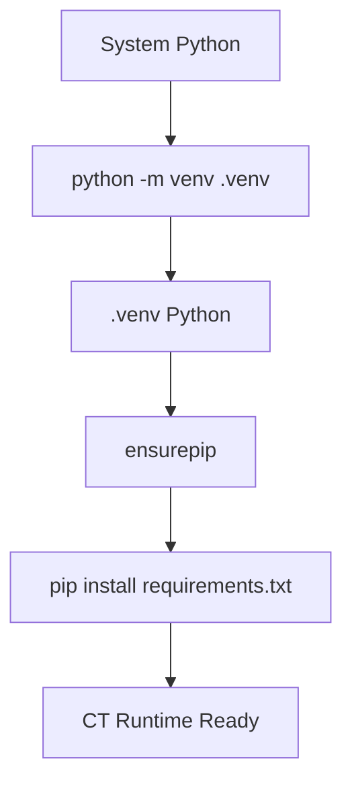
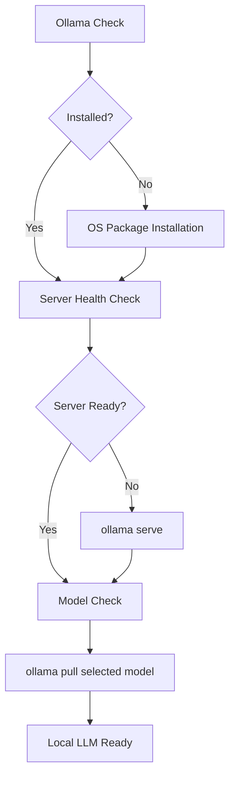
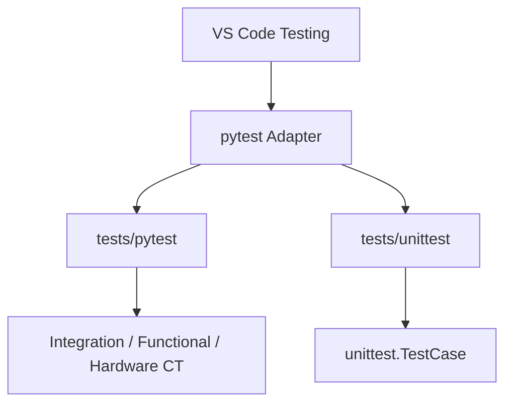
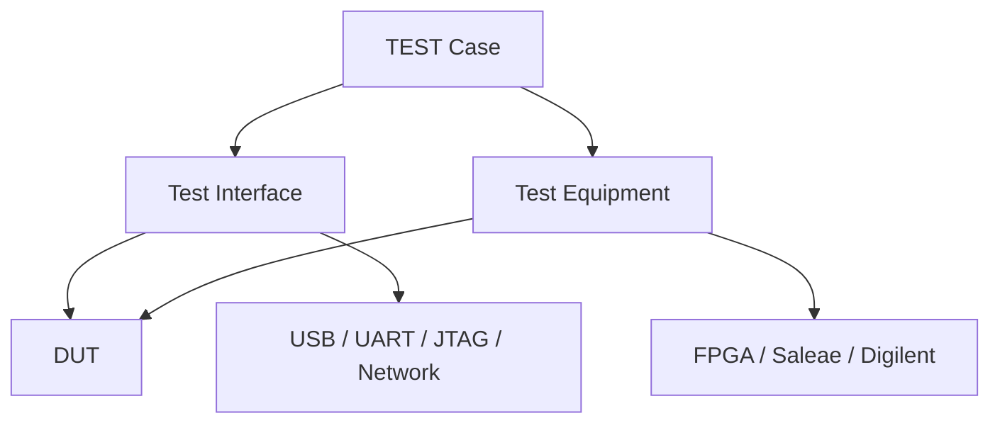
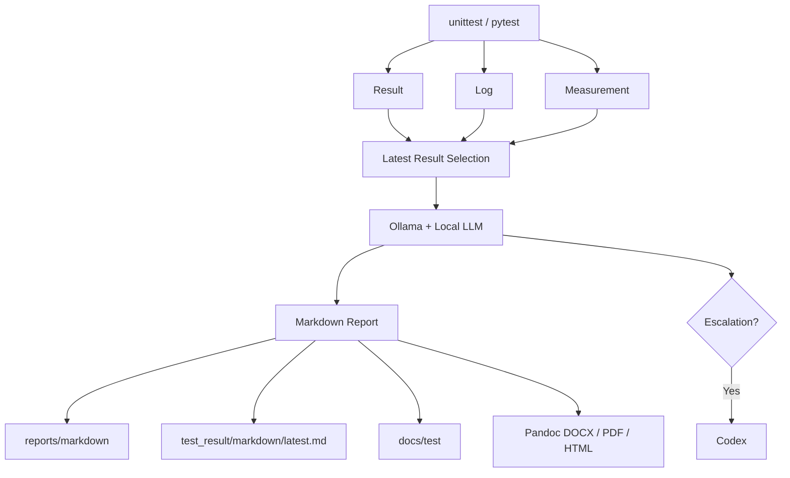

# AI-driven Continuous Testing

## 1. CT 환경 구성 — Python

### 구성 요소

| 항목 | 구성 |
|---|---|
| Runtime | Python project-local virtual environment |
| Virtual environment | `.venv` |
| Dependency manifest | `requirements.txt` |
| Unit test | `unittest` |
| Continuous test | `pytest` |
| Hardware libraries | `pyserial`, `pyusb` |
| Report tools | MkDocs, Pandoc integration |

### 설치 흐름



### 실행 경로

```text
.venv/
└── Scripts/
    ├── python.exe
    ├── pytest.exe
    ├── mkdocs.exe
    └── pip.exe
```

### VS Code 실행

- Run and Debug: `Setup 1: Install Python Virtual Environment`
- Task: `Setup: Create Python Virtual Environment`
- Setup module: `python -m tools.environment_setup python`

## 2. Ollama 환경 구성

### 구성 요소

| 항목 | 구성 |
|---|---|
| Local LLM runtime | Ollama |
| Primary model | `model_config.json` / `OLLAMA_MODEL` |
| Default endpoint | `http://127.0.0.1:11434` |
| Endpoint variable | `OLLAMA_URL` |
| Model variable | `OLLAMA_MODEL` |
| Model config | `tools/local_llm/model_config.json` |
| Model selection | `selected` preset |
| Installed inventory | `python -m tools.local_llm status` |
| Offline fallback | Deterministic analyzer |
| Escalation | Codex |

### 설치 흐름



### OS 설치 방식

| OS | Installer |
|---|---|
| Windows | `winget install Ollama.Ollama` |
| macOS | `brew install ollama` |
| Linux | Ollama official installer |

### VS Code 실행

- Run and Debug: `Setup 2: Install Ollama and Local LLM`
- Task: `Setup: Install Ollama and Pull Local LLM`
- Setup module: `python -m tools.environment_setup ollama [--model <model>]`
- Status launch/task: `Local LLM: Show Configuration and Installed Models`

## 3. VS Code 환경 구성

### 설정 파일

```text
.vscode/
├── settings.json
├── launch.json
└── tasks.json
```

### Run and Debug

| Configuration | 기능 |
|---|---|
| `Setup 1: Install Python Virtual Environment` | `.venv` 생성 및 Python dependency 설치 |
| `Setup 2: Install Ollama and Local LLM` | Ollama 설치, 서버 실행, 선택 모델 pull |
| `Local LLM: Show Configuration and Installed Models` | 설정 모델 및 설치 모델 목록 출력 |
| `Run 3: Extension Module` | 확장 모듈 `main()` 실행 |
| `Test Result: Generate Latest Markdown` | 최근 TEST 결과 Markdown 생성 |
| `Debug: Current Python File` | 현재 Python 파일 디버그 |
| `Debug: Current pytest File` | 현재 pytest 파일 디버그 |

### Testing



### Tasks

| Group | Task |
|---|---|
| Setup | Python `.venv` |
| Setup | Ollama + Local LLM |
| Test | pytest all |
| Test | Continuous Tests |
| Test | unittest suite |
| Report | Latest Markdown |
| Report | Pandoc HTML |
| MkDocs | Serve / Build / Strict Build |

## 4. TEST 구조도

### Repository Structure

```text
tests/
├── pytest/
│   ├── test_cases/
│   │   ├── communication/
│   │   ├── timing/
│   │   ├── functional/
│   │   ├── performance/
│   │   ├── stability/
│   │   └── regression/
│   ├── test_equipments/
│   │   ├── fpga/
│   │   ├── saleae/
│   │   └── digilent/
│   ├── test_interfaces/
│   │   ├── usb/
│   │   ├── uart/
│   │   ├── jtag/
│   │   └── network/
│   └── conftest.py
└── unittest/
    ├── python/
    ├── c_cpp/
    ├── firmware/
    └── common/
```

### Layer Structure



### Layer Responsibility

| Layer | 책임 |
|---|---|
| Test Case | Scenario, parameters, assertions |
| Test Interface | DUT communication transport |
| Test Equipment | Measurement and external control |
| Fixture | Connect, initialize, yield, cleanup |
| Result Recorder | Result, log, measurement 저장 |

### Interface Contract

```python
connect()
disconnect()
read()
write()
execute()
```

## 5. TEST Result Report 구조도

### Data Flow



### Runtime Data

```text
reports/
├── logs/<test-id>/<execution-id>/
│   ├── result.json
│   ├── analysis.json
│   ├── codex-escalation.json
│   ├── test.log
│   ├── stdout.log
│   ├── stderr.log
│   ├── equipment.log
│   └── interface.log
├── measurements/<test-id>/<execution-id>/
│   ├── measurement.json
│   └── measurement.csv
└── markdown/<test-id>/
    ├── latest.md
    └── <execution-id>/result.md
```

### MkDocs Data

```text
docs/
├── index.md
└── test/
    ├── index.md
    ├── unit/
    │   ├── <test-id>.md
    │   └── <test-id>/<execution-id>.md
    └── ct/<category>/
        ├── <test-id>.md
        └── <test-id>/<execution-id>.md
```

### Index Responsibility

| File | 구성 | 갱신 방식 |
|---|---|---|
| `docs/index.md` | 기본 시스템 5개 구성 | Manual |
| `docs/test/index.md` | TEST 목록, 최신 링크, 실행 이력 | Automatic |
| `<test-id>.md` | TEST별 최신 결과 | Automatic |
| `<test-id>/<execution-id>.md` | 실행별 결과 | Append-only |

### Report Generation

```text
python -m test_result --docs
├── Latest result selection
├── Local LLM analysis
├── Canonical Markdown generation
├── Execution snapshot creation
├── Latest TEST page update
└── docs/test/index.md update
```
