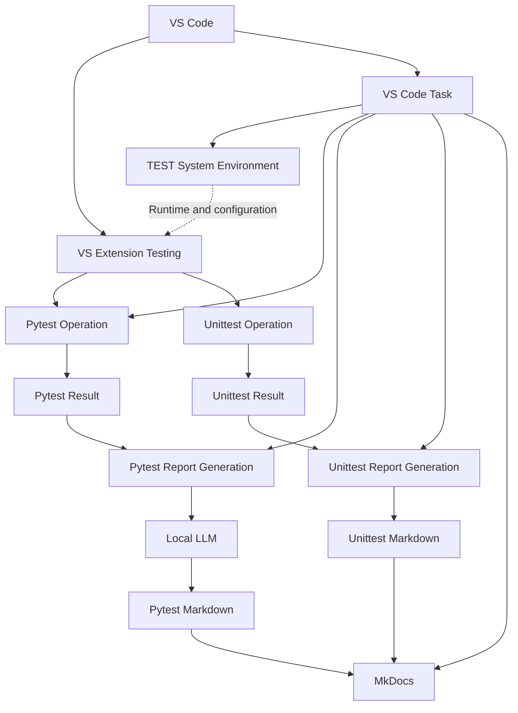
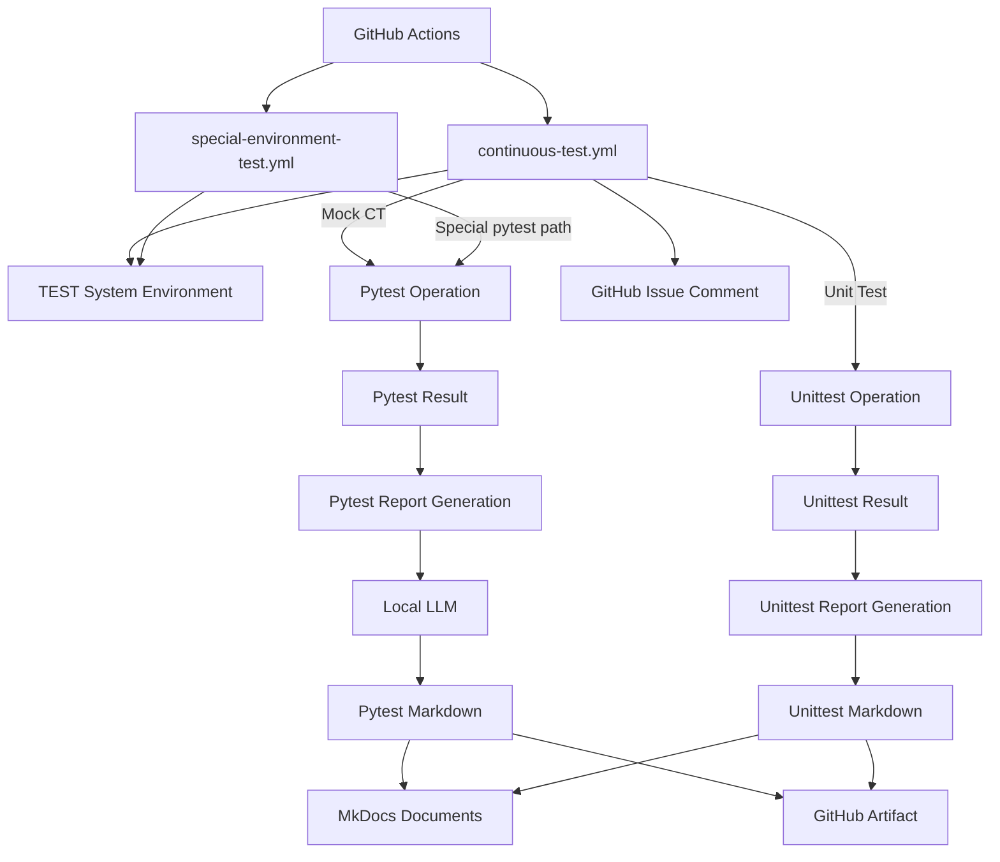

# AI-driven Continuous Testing

## System Overview

| Area | Role |
|---|---|
| VS Code | Common entry point for Testing, Tasks, debugging, and environment setup |
| GitHub Actions | CI entry point for hosted Mock/unit tests and optional self-hosted hardware tests |
| pytest CT | Runs TEST ID scenarios using a final `mock` or `hil` fixture mode |
| unittest | Runs function-level framework and extension tests without TEST ID or fixture mode |
| Result pipeline | Normalizes execution data and generates Markdown reports |
| Local LLM | Analyzes pytest CT results only; it is not used for unittest |
| MkDocs | Publishes pytest and unittest Markdown and execution history |

## Documents

<br/>

| Scope | Document | Components |
|---|---|---|
| Python Environment | [python_environment.md](python_environment.md) | OS, Python, venv, dependencies |
| Local LLM Environment | [local_llm_environment.md](local_llm_environment.md) | Ollama, model, prompt, check |
| VS Code Environment | [vscode_environment.md](vscode_environment.md) | Settings, Launch, Tasks, Testing |
| Pytest Operation | [pytest_operation.md](pytest_operation.md) | TEST ID, Fixture, Mock/HIL, Local LLM |
| Unittest Operation | [unittest_operation.md](unittest_operation.md) | Function, Execution ID, Result, Markdown |
| Pytest / HIL / Mock | [pytest.md](pytest.md) | Test cases, fixture mapping, mode selection, HIL gate |
| Unittest | [unittest.md](unittest.md) | Function result contract |
| Pytest Results | [tests/pytest/index.md](tests/pytest/index.md) | TEST ID, Execution history |
| Unittest Results | [tests/unittest/index.md](tests/unittest/index.md) | Function count, Execution history |

## TEST Flow

### VS Code-based flow



| VS Code entry | Execution scope |
|---|---|
| VS Extension Testing | Discovers and runs both pytest CT and unittest through the pytest adapter |
| VS Code Task | Prepares the test environment, runs pytest CT by TEST ID/mode, generates reports, and serves/builds MkDocs |

### GitHub Actions-based flow



| GitHub Actions entry | Execution scope |
|---|---|
| `continuous-test.yml` | Runs unittest or Mock CT on a GitHub-hosted Ubuntu runner, generates reports, comments on issue requests, and uploads evidence |
| `special-environment-test.yml` | Runs a selected pytest path on a self-hosted hardware runner, generates a report, and uploads evidence |

## GitHub Actions Flow

### `continuous-test.yml`

| Item | Current behavior |
|---|---|
| Workflow name | `Continuous Test` |
| Trigger | Issue labeled `run-test` or manual `workflow_dispatch` |
| Job condition | Manual run, or the added issue label is exactly `run-test` |
| Runner | `ubuntu-latest` |
| Timeout | 30 minutes |
| Permissions | Repository contents read; issues write |
| Python | `actions/setup-python@v5`, Python 3.12, pip cache |
| Environment | Creates `.venv` and installs `requirements.txt` |
| Request routing | `test_envs.tools.issue_parser` selects Unit Test or CT |
| Unit Test | pytest over `test_envs/tests/unittest`, then JUnit normalization |
| CT | Selected TEST ID under `test_envs/tests/pytest/test_cases`; current marker defaults produce Mock CT |
| Report | `test_envs.tools.pipeline --docs` runs even after test failure |
| Issue output | `test_envs.tools.github_reporter` comments when an issue number exists |
| Artifact | Uploads `test_envs/reports/` and published pytest/unittest documents |

The manual `runner` input currently accepts `Default`, `Windows`, or `Linux`, but the job's `runs-on` remains fixed to `ubuntu-latest`; that input does not select a runner in the current workflow.

### `special-environment-test.yml`

| Item | Current behavior |
|---|---|
| Workflow name | `Optional Special Environment Test` |
| Trigger | Manual `workflow_dispatch` only |
| Input | `test_path`, default `test_envs/tests/pytest` |
| Runner | `[self-hosted, hw-test]` |
| Timeout | 60 minutes |
| Shell | PowerShell (`pwsh`) |
| Environment | Reuses `.venv` when present or creates it, then installs `requirements.txt` |
| Test | Executes pytest for the selected special hardware/environment path |
| Report | `test_envs.tools.pipeline --docs` runs even after test failure |
| Artifact | Uploads `test_envs/reports/` as `special-test-<run-id>` |

### Workflow roles

| Workflow | Primary role | Local LLM rule |
|---|---|---|
| `continuous-test.yml` | Repeatable hosted Unit Test and Mock CT automation | Used only when the selected result is pytest CT; unittest bypasses it |
| `special-environment-test.yml` | Optional hardware, vendor-tool, internal-network, or machine-specific testing | Used for pytest CT results; unavailable Ollama falls back to deterministic analysis |

## Test System Paths

<br/>

```
.
├── .github/
│   └── workflows/
│       ├── continuous-test.yml
│       ├── special-environment-test.yml
│       └── github_pages.yaml
├── .vscode/
│   ├── settings.json
│   ├── launch.json
│   └── tasks.json
├── docs/
├── site/
└── test_envs/
    ├── configs/
    │   ├── config.json
    │   ├── check.json
    │   ├── pytest/
    │   └── unittest/
    ├── tests/
    ├── reports/
    └── tools/
```

| Scope | Path |
|---|---|
| Project config | `test_envs/configs/config.json` |
| Environment check | `test_envs/configs/check.json` |
| pytest | `test_envs/tests/pytest` |
| unittest | `test_envs/tests/unittest` |
| Results | `test_envs/reports/results` |
| Local LLM logs | `test_envs/reports/local_llm` |
| Markdown | `test_envs/reports/markdown` |
| Pandoc | `test_envs/reports/pandoc` |

## Identifier

| Identifier | pytest | unittest | Format |
|---|---:|---:|---|
| TEST ID | O | X | `CT-<TARGET>-<NNN>` |
| Execution ID | O | O | `YYYYMMDD_HHMMSS_ffffff` |

## Local LLM

The Local LLM is part of the pytest report branch only. A unittest result is converted directly to Markdown without an Ollama request, Local LLM log, analysis payload, or escalation decision.

| Runner | Local LLM | Processing rule |
|---|---:|---|
| pytest CT | O | Analyze result, logs, warnings, and optional source diff before Markdown generation |
| unittest | X | Generate execution summary and function results directly from normalized data |

### Local LLM roles

| Role | Input | Output / decision |
|---|---|---|
| Evidence collection | Pytest result JSON, errors, warnings, important log lines | Bounded evidence payload; no invented evidence |
| Prompt selection | Non-empty CT marker `test_prompt`; otherwise configured `ollama.default_prompt` | Effective analysis instruction |
| Result summary | Status, duration, metrics, statistics, and logs | Human-readable `summary` |
| Failure classification | Result status and captured failure evidence | `classification` and `failure_analysis` |
| Confidence estimation | Available test and log evidence | `confidence` from `0.0` to `1.0` |
| Warning analysis | Captured warning lines | Structured warnings with `Critical`, `Important`, or `Low` severity |
| Source review | Optional local Git diff from `--source-review` | `source_review`; otherwise `Not requested` |
| Recommendation | Analysis findings | Actionable `recommendations` |
| Escalation judgment | LLM escalation flag, confidence, failure classification, and repeated failures | `needs_escalation` plus Codex escalation reasons |
| Offline fallback | Ollama request failure or invalid response | Deterministic summary, classification, warnings, and recommendation |

### Pytest analysis flow

```text
Pytest Result JSON + Test Log
             +
Optional Source Diff
             ↓
Prompt selection
├── @pytest.mark.ct(test_prompt="...")
└── ollama.default_prompt
             ↓
Local LLM / Deterministic Fallback
             ↓
Test analysis + Escalation decision
             ↓
Pytest Markdown + MkDocs
```

| Item | Path / rule |
|---|---|
| Runtime | Ollama |
| Configuration | `test_envs/configs/config.json → ollama` |
| Analysis payload | Pytest result JSON → `test_analysis` |
| Diagnostic log | `test_envs/reports/local_llm/<execution-id>_local_llm.log` |
| Unittest Local LLM log | Not generated |
| Detailed setup | [local_llm_environment.md](local_llm_environment.md) |
