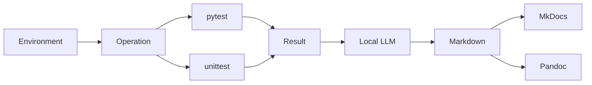

# AI-driven Continuous Testing

## 문서 구성

| 구분 | 문서 | 구성 |
|---|---|---|
| 환경 구성 | [Open](environment.md) | Python, Ollama, VS Code, OS, Config |
| 동작 구성 | [Open](operation.md) | TEST, Fixture, Result, Local LLM, Report |
| pytest | [Open](pytest.md) | pytest 실행·Fixture mode |
| pytest HIL / Mock | [Open](hil_mock.md) | pytest 전용 mode·CLI override·HIL gate |
| unittest | [Open](unittest.md) | unittest 실행 |
| pytest Results | [Open](tests/pytest/index.md) | TEST ID·Execution history |
| unittest Results | [Open](tests/unittest/index.md) | Execution history |

## 시스템 구성

## 핵심 경로

| 구분 | 경로 |
|---|---|
| Project config | `test_envs/configs/config.json` |
| Environment check | `test_envs/configs/check.json` |
| pytest | `test_envs/tests/pytest` |
| unittest | `test_envs/tests/unittest` |
| Results | `test_envs/reports/results` |
| Local LLM logs | `test_envs/reports/local_llm` |
| Markdown | `test_envs/reports/markdown` |
| Pandoc | `test_envs/reports/pandoc` |

## Identifier

| Identifier | Scope | Definition | Format |
|---|---|---|---|
| TEST ID | pytest only | `test_envs/tests/pytest/test_cases` | `CT-<TARGET>-<NNN>` |
| Execution ID | pytest, unittest | Result delimiter·search key | `YYYYMMDD_HHMMSS_ffffff` |
