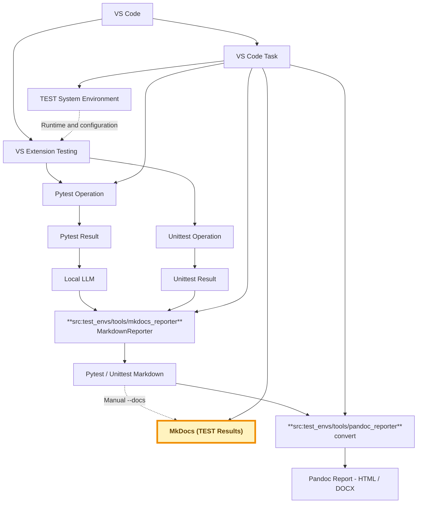
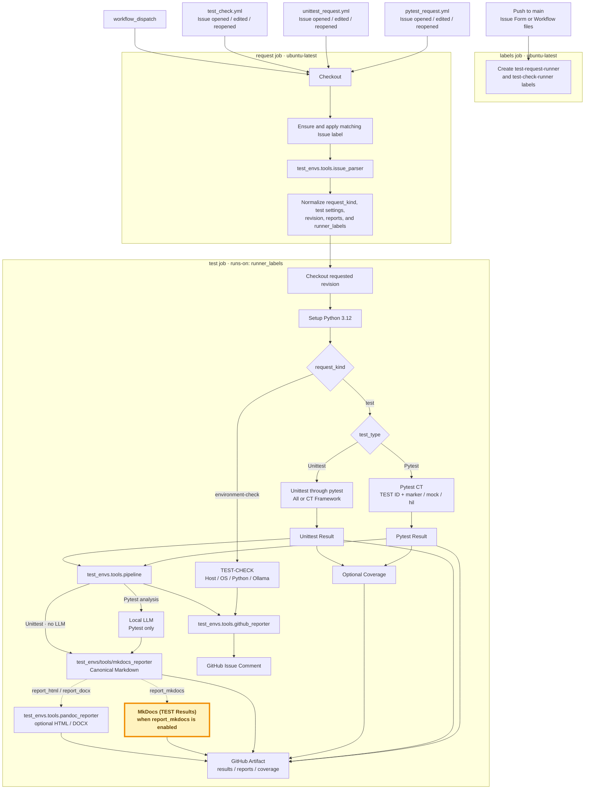

# AI-driven Continuous Testing

## System Overview

<br/>

| Area | Role |
|---|---|
| VS Code | Common entry point for Testing, Tasks, debugging, and environment setup |
| GitHub Actions | CI entry point for hosted Mock/unit tests and optional self-hosted hardware tests |
| pytest CT | Runs TEST ID scenarios using a final `mock` or `hil` fixture mode |
| unittest | Runs function-level framework and extension tests without TEST ID or fixture mode |
| Result pipeline | Normalizes execution data and generates Markdown reports |
| Local LLM | Analyzes pytest CT results only; it is not used for unittest |
| MkDocs | Publishes pytest and unittest Markdown and execution history |

<br/>

Go to [VSCode Testing](https://jeonghunlee.github.io/vscode_doc/#vscode-testing)  

!!! success "AI Agent workflow based on MCP"   
    Connect Claude, Codex, Ollama, and GitHub operations through MCP  
    Support Local MCP execution, GitHub Issue based TEST automation, and documentation-first project flow    
    https://jeonghunlee.github.io/local-ai-agent-mcp/index.html


<br/>

## Documents

<br/>

| Scope | Document | Components |
|---|---|---|
| Python Environment | [python_environment.md](python_environment.md) | OS, Python, venv, dependencies |
| Local LLM Environment | [local_llm_environment.md](local_llm_environment.md) | Ollama, model, prompt, check |
| VS Code Environment | [vscode_environment.md](vscode_environment.md) | Settings, Launch, Tasks, Testing |
| Pytest Operation | [pytest_operation.md](pytest_operation.md) | TEST ID, Fixture, Mock/HIL, Local LLM |
| Unittest Operation | [unittest_operation.md](unittest_operation.md) | Function, Execution ID, Result, Markdown |
| Pytest / HIL / Mock | [pytest_framework.md](pytest_framework.md) | Test cases, fixture mapping, mode selection, HIL gate |
| Unittest | [unittest_framework.md](unittest_framework.md) | Function result contract |
| Pytest Results | [tests/pytest/index.md](tests/pytest/index.md) | TEST ID, Execution history |
| Unittest Results | [tests/unittest/index.md](tests/unittest/index.md) | Function count, Execution history |

<br/>

## TEST Flow

<br/>

### VS Code-based flow

<br/>


Go To [VS Code Testing Setup](https://jeonghunlee.github.io/vscode_doc/#settingjson)   
Go To [VS Code Testing](https://jeonghunlee.github.io/vscode_doc/#vscode-testing)    

<br/>



<br/>

| VS Code entry | Execution scope |
|---|---|
| VS Extension Testing | Discovers and runs both pytest CT and unittest through the pytest adapter |
| VS Code Task | Prepares the environment, runs pytest CT, generates MkDocs reports, and converts the latest Markdown to Pandoc HTML/DOCX |
| Common Markdown reporter | `test_envs/tools/mkdocs_reporter` renders both pytest and unittest results through `MarkdownReporter` |
| Pandoc reporter | `test_envs/tools/pandoc_reporter` converts the latest common Markdown report to HTML or DOCX |


!!! success "Automatically Generate Report"
    Analyze Result.log and result.json using an LLM, 
    then automatically update the analysis report in the **MkDocs documentation.**    
    
    * **Left Menu TEST Results**    
        * Go To [TEST Results Pytest](./tests/pytest/index.md)   
        * Go To [TEST Results Unittest](./tests/unittest/index.md)       


<br/>

### GitHub Actions-based flow

<br/>



<br/>

| GitHub Actions entry | Execution scope |
|---|---|
| `pytest_request.yml` | Pytest-only form: TEST ID, `marker`/`mock`/`hil`, runner, revision, Coverage, optional Pandoc, and evidence |
| `unittest_request.yml` | Unittest-only form: All or CT Framework scope, runner, revision, Coverage, and optional Pandoc; no TEST ID, Fixture, Target, Evidence, or Expected Result |
| `test_check.yml` | Selects only a runner; the workflow detects its host type, OS, Python, and Ollama state and comments on the Issue |
| `continuous-test.yml` | Routes the request to a hosted or self-hosted runner, executes the test, generates reports, updates the Issue, and uploads evidence |
| Common Markdown reporter | `test_envs/tools/mkdocs_reporter` always renders the canonical Markdown; MkDocs publication is enabled separately and the generated reports are uploaded as artifacts |

<br/>

!!! success "Github Issues and Automatically Generate Report"
    - Request [Github Issue and Github Actions](https://github.com/JeonghunLee/AI-driven-CI-CT/issues)               
    * **Left Menu TEST Results**    
        * Go To [TEST Results Pytest](./tests/pytest/index.md)   
        * Go To [TEST Results Unittest](./tests/unittest/index.md)     

<br/>

## GitHub Actions Flow

<br/>

### `continuous-test.yml`

| Item | Current behavior |
|---|---|
| Workflow name | `Test Request` |
| Trigger | Request Issue `opened`, `edited`, or `reopened`; or manual `workflow_dispatch` |
| Duplicate prevention | The workflow does not subscribe to `labeled`; automatic label attachment therefore does not create a second run |
| Request Job | Detects Pytest, Unittest, or TEST-CHECK from the form title and emits normalized execution settings |
| Issue labels | A relevant default-branch push creates both labels; the request job also creates and applies the matching label as a first-Issue fallback |
| Runner routing | GitHub-hosted Linux → `ubuntu-latest`; GitHub-hosted Windows → `windows-latest`; HIL Linux → `[self-hosted, linux, hw-test]`; HIL Windows → `[self-hosted, windows, hw-test]` |
| Timeout | 60 minutes |
| Permissions | Repository contents read; issues write |
| Python | `actions/setup-python@v5`, Python 3.12, pip cache |
| Environment | Test requests create `.venv` and install `requirements.txt`; TEST-CHECK inspects the selected runner directly |
| Unittest | Runs All Unittest or CT Framework Python through pytest without Local LLM analysis |
| Pytest CT | Mock runs on GitHub-hosted Linux/Windows; physical HIL routes to the self-hosted hardware runner |
| Coverage | Optional terminal or HTML `pytest-cov` report |
| Report | Always creates canonical Markdown; Issue Forms optionally convert Pandoc HTML/DOCX, while manual dispatch can additionally publish MkDocs |
| Issue output | `test_envs.tools.github_reporter` comments on success, test failure, report failure, or missing result |
| Artifact | Uploads results, MkDocs pages, `.coverage`, and `htmlcov/` |
| Node.js | No project Node.js setup or command; official GitHub Actions manage their own embedded runtime |

<br/>

### Workflow roles

<br/>

| Workflow | Primary role | Local LLM rule |
|---|---|---|
| `continuous-test.yml` | Unified hosted, Windows, and self-hosted HIL test-request automation | Pytest uses Local LLM with deterministic fallback; Unittest bypasses Local LLM |

<br/>

## Test System Paths

<br/>

```
.
├── .github/
│   ├── ISSUE_TEMPLATE/
│   │   ├── pytest_request.yml
│   │   ├── unittest_request.yml
│   │   └── test_check.yml
│   └── workflows/
│       ├── continuous-test.yml
│       └── github_pages.yaml
├── .vscode/
│   ├── settings.json
│   ├── launch.json
│   └── tasks.json
├── docs/
├── site/
└── test_envs/
    ├── configs/
    │   ├── config.json
    │   ├── check.json
    │   ├── pytest/
    │   └── unittest/
    ├── tests/
    ├── reports/
    └── tools/
```
<br/>

| Scope | Path |
|---|---|
| Project config | `test_envs/configs/config.json` |
| Environment check | `test_envs/configs/check.json` |
| pytest | `test_envs/tests/pytest` |
| unittest | `test_envs/tests/unittest` |
| Results | `test_envs/reports/results` |
| Local LLM logs | `test_envs/reports/local_llm` |
| Markdown | `test_envs/reports/markdown` |
| Pandoc | `test_envs/reports/pandoc` |

<br/>

## Identifier

<br/>

| Identifier | pytest | unittest | Format |
|---|---:|---:|---|
| TEST ID | O | X | `CT-<TARGET>-<NNN>` |
| Execution ID | O | O | `YYYYMMDD_HHMMSS_ffffff` |

<br/>

## Local LLM

<br/>

The Local LLM is part of the pytest report branch only. A unittest result is converted directly to Markdown without an Ollama request, Local LLM log, analysis payload, or escalation decision.

<br/>

| Runner | Local LLM | Processing rule |
|---|---:|---|
| pytest CT | O | Analyze result, logs, warnings, and optional source diff before Markdown generation |
| unittest | X | Generate execution summary and function results directly from normalized data |

<br/>

### Local LLM roles

<br/>

| Role | Input | Output / decision |
|---|---|---|
| Evidence collection | Pytest result JSON, errors, warnings, important log lines | Bounded evidence payload; no invented evidence |
| Prompt selection | Non-empty CT marker `test_prompt`; otherwise configured `ollama.default_prompt` | Effective analysis instruction |
| Result summary | Status, duration, metrics, statistics, and logs | Human-readable `summary` |
| Failure classification | Result status and captured failure evidence | `classification` and `failure_analysis` |
| Confidence estimation | Available test and log evidence | `confidence` from `0.0` to `1.0` |
| Warning analysis | Captured warning lines | Structured warnings with `Critical`, `Important`, or `Low` severity |
| Source review | Optional local Git diff from `--source-review` | `source_review`; otherwise `Not requested` |
| Recommendation | Analysis findings | Actionable `recommendations` |
| Escalation judgment | LLM escalation flag, confidence, failure classification, and repeated failures | `needs_escalation` plus Codex escalation reasons |
| Offline fallback | Ollama request failure or invalid response | Deterministic summary, classification, warnings, and recommendation |

<br/>

### Pytest analysis flow

<br/>

```text
Pytest Result JSON + Test Log
             +
Optional Source Diff
             ↓
Prompt selection
├── @pytest.mark.ct(test_prompt="...")
└── ollama.default_prompt
             ↓
Local LLM / Deterministic Fallback
             ↓
Test analysis + Escalation decision
             ↓
Pytest Markdown + MkDocs
```

<br/>

| Item | Path / rule |
|---|---|
| Runtime | Ollama |
| Configuration | `test_envs/configs/config.json → ollama` |
| Analysis payload | Pytest result JSON → `test_analysis` |
| Diagnostic log | `test_envs/reports/local_llm/<execution-id>_local_llm.log` |
| Unittest Local LLM log | Not generated |
| Detailed setup | [local_llm_environment.md](local_llm_environment.md) |

<br/>
