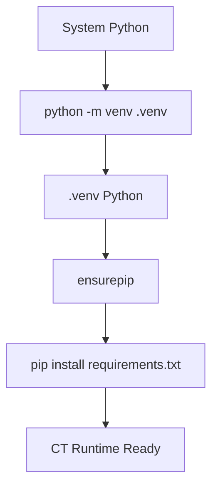
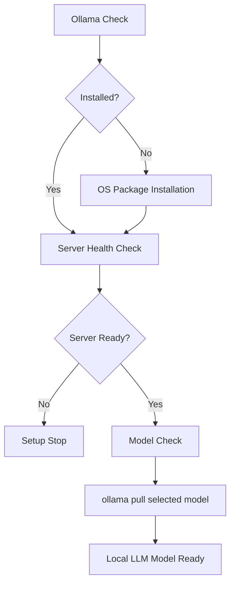
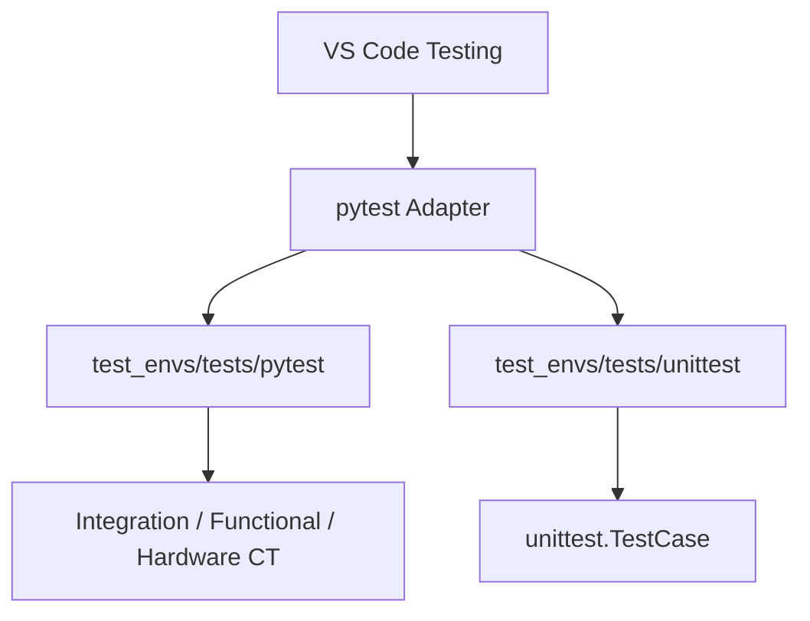
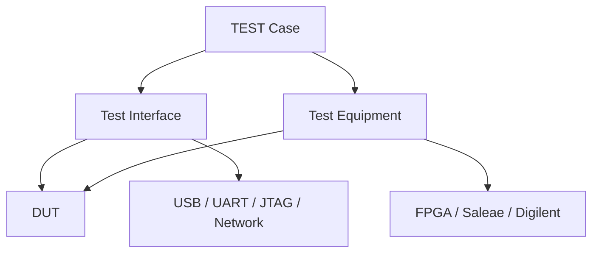
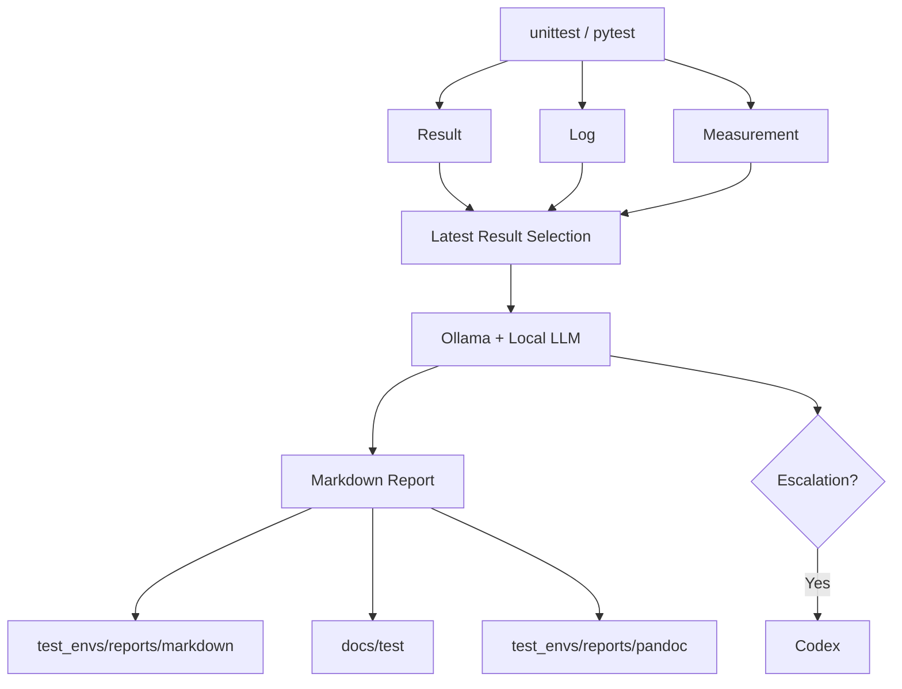

# AI-driven Continuous Testing

## 1. CT 환경 구성 — Python

### 구성 요소

| 항목 | 구성 |
|---|---|
| Runtime | Python project-local virtual environment |
| Virtual environment | `.venv` |
| Dependency manifest | `requirements.txt` |
| Unit test | `unittest` |
| Continuous test | `pytest` |
| Hardware libraries | `pyserial`, `pyusb` |
| Report tools | MkDocs, Pandoc integration |

### 설치 흐름



### 실행 경로

```text
.venv/
└── Scripts/
    ├── python.exe
    ├── pytest.exe
    ├── mkdocs.exe
    └── pip.exe
```

### VS Code 실행

- Run and Debug: `SETUP 2: Install Python Virtual Environment`
- Task: `SETUP 2: Install Python Virtual Environment`
- Setup module: `python -m test_envs.tools.environment_setup python`

## 2. Ollama 환경 구성

### 구성 요소

| 항목 | 구성 |
|---|---|
| Local LLM runtime | Ollama |
| Primary model | `test_envs/configs/config.json` / `OLLAMA_MODEL` |
| Default endpoint | `http://127.0.0.1:11434` |
| Endpoint variable | `OLLAMA_URL` |
| Model variable | `OLLAMA_MODEL` |
| Project config | `test_envs/configs/config.json` |
| Environment check | `test_envs/configs/check.json` |
| Model selection | `ollama.selected_model` |
| Installed inventory | `python -m test_envs.tools.configuration check` |
| Offline fallback | Deterministic analyzer |
| Escalation | Codex |

### 설치 흐름



### OS 설치 방식

| OS | Installer |
|---|---|
| Windows | `winget install Ollama.Ollama` |
| macOS | `brew install ollama` |
| Linux | Ollama official installer |

### 플랫폼 선택

| 선택값 | 동작 |
|---|---|
| `auto` | 현재 운영체제 자동 감지 |
| `config` | `test_envs/configs/config.json` / `os` |
| `windows` | Windows + winget |
| `linux` | Linux + official installer |
| `macos` | macOS + Homebrew |

- VS Code input: `targetOS`
- Host mismatch: setup 중단
- Default: `config`

### VS Code 실행

- Run and Debug: `SETUP 3: Install Ollama and Local LLM`
- Task: `SETUP 3: Install Ollama and Local LLM`
- Setup module: `python -m test_envs.tools.environment_setup ollama [--model <model>]`
- Check task: `CHECK 1: Refresh Environment Check File`
- Check launch: `CHECK 1: Refresh Environment Check File`
- Foreground server task: `CHECK 3: Run Ollama Server (Foreground)`
- Setup child server: None
- Server lifecycle: Foreground task ownership
- Existing server: Reuse / exit `0`

## 3. VS Code 환경 구성

### 설정 파일

```text
.vscode/
├── settings.json
├── launch.json
└── tasks.json
```

### Run and Debug

| Configuration | 기능 |
|---|---|
| `SETUP 1: Select Operating System` | `test_envs/configs/config.json` OS update |
| `SETUP 2: Install Python Virtual Environment` | Python setup Task delegation |
| `SETUP 3: Install Ollama and Local LLM` | Ollama setup Task delegation |

| Setup 1 runtime | Rule |
|---|---|
| Launch / Task Python | `python` |
| Virtual environment | System Python re-exec |
| System environment | Direct execution |
| `CHECK 1: Refresh Environment Check File` | Environment check Task delegation |
| `Run 3: Extension Module` | 확장 모듈 `main()` 실행 |
| `Test Result: Generate Latest Markdown` | 최근 TEST 결과 Markdown 생성 |
| `Debug: Current Python File` | 현재 Python 파일 디버그 |
| `Debug: Current pytest File` | 현재 pytest 파일 디버그 |

| Launch constraint | 값 |
|---|---|
| Setup / Check | `preLaunchTask` delegation |
| Background process | None |

### Cross-platform Python

| 항목 | 설정 |
|---|---|
| Default interpreter | `${workspaceFolder}/.venv` |
| Setup 1·2 interpreter | `python` |
| Setup 3+ interpreter | `${config:python.defaultInterpreterPath}` |
| OS-specific path | `.vscode/settings.json` only |
| Testing interpreter | Setup 1 synchronized path |
| MkDocs execution | `python -m mkdocs` |

### Testing



### Tasks

| Group | Task |
|---|---|
| Setup | Python `.venv` |
| Setup | Ollama + Local LLM |
| TEST 1 | pytest all |
| TEST 2 | Continuous Tests |
| TEST 3 | unittest suite |
| Report | Latest Markdown |
| Report | Pandoc HTML |
| MkDocs | Serve / Build / Strict Build |

## 4. TEST 구조도

| Interface | Test ID | Measurement |
|---|---|---|
| UART | `CT-UART-001` | baudrate, error, jitter |
| USB | `CT-USB-001` | bytes, packets, integrity |
| Network | `CT-NETWORK-001` | bytes, packets, latency, integrity |

| Tool group | Directory | Tools |
|---|---|---|
| Equipment | `test_envs/tests/pytest/test_equipments/` | FPGA, Saleae, Digilent |
| Interface | `test_envs/tests/pytest/test_interfaces/` | USB, UART, JTAG, Network |

| Mode | Directory | Result |
|---|---|---|
| Mock | `mock/` | `test_mode/interface_mode/equipment_mode = mock` |
| HIL | `hil/` | `test_mode/interface_mode/equipment_mode = hil` |

| Selection | Derived |
|---|---|
| `@pytest.mark.ct:fixture_mode` | `test_mode`, `interface_mode`, `equipment_mode` |

### Repository Structure

```text
.
├── docs/
└── test_envs/
    ├── configs/
    │   ├── config.json
    │   ├── check.json
    │   └── unittest/                     # Future extension
    ├── tests/
    │   ├── pytest/
    │   │   ├── test_cases/test_fixture_<NNN>_<test-content>.py
    │   │   ├── fixtures/
    │   │   ├── test_equipments/{fpga,saleae,digilent}/{mock,hil}/
    │   │   ├── test_interfaces/{usb,uart,jtag,network}/{mock,hil}/
    │   │   └── conftest.py
    │   └── unittest/
    │       ├── ct_framework/python/
    │       ├── python/
    │       ├── c_cpp/
    │       ├── firmware/
    │       └── common/
    ├── reports/
    └── tools/
```

### Layer Structure



### Layer Responsibility

| Layer | 책임 |
|---|---|
| Test Case | Scenario, parameters, assertions |
| Test Interface | DUT communication transport |
| Test Equipment | Measurement and external control |
| Fixture | Connect, initialize, yield, cleanup |
| Result Recorder | Result, log, measurement 저장 |

### Interface Contract

```python
connect()
disconnect()
read()
write()
execute()
```

## 5. TEST Result Report 구조도

### Data Flow



### Runtime Data

```text
test_envs/reports/
├── pytest/test_cases/<test-id>/
│   └── <timestamp>_{result,raw,measurement,test,stdout,stderr,equipment,interface}.*
├── unittest/<test-id>/
│   └── <timestamp>_<artifact>.<extension>
├── pandoc/<test-id>/
│   └── <timestamp>_result.{html,pdf,docx}
└── markdown/<test-id>/
    └── <timestamp>_result.md
```

### MkDocs Data

```text
docs/
├── index.md
└── test/
    ├── index.md
    ├── unit/
    │   ├── <test-id>.md
    │   └── <test-id>/<execution-id>.md
    └── ct/<category>/
        ├── <test-id>.md
        └── <test-id>/<execution-id>.md
```

### Index Responsibility

| File | 구성 | 갱신 방식 |
|---|---|---|
| `docs/index.md` | 기본 시스템 5개 구성 | Manual |
| `docs/test/index.md` | TEST 목록, 최신 링크, 실행 이력 | Automatic |
| `<test-id>.md` | TEST별 최신 결과 | Automatic |
| `<test-id>/<execution-id>.md` | 실행별 결과 | Append-only |

### Report Generation

```text
python -m test_envs.tools.test_result --docs
├── Latest result selection
├── Local LLM analysis
├── Canonical Markdown generation
├── Execution snapshot creation
├── Latest TEST page update
└── docs/test/index.md update
```
