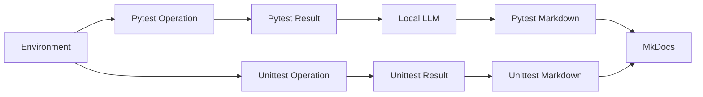

# AI-driven Continuous Testing

## Documents

| Scope | Document | Components |
|---|---|---|
| Python Environment | [python_environment.md](python_environment.md) | OS, Python, venv, dependencies |
| Local LLM Environment | [local_llm_environment.md](local_llm_environment.md) | Ollama, model, prompt, check |
| VS Code Environment | [vscode_environment.md](vscode_environment.md) | Settings, Launch, Tasks, Testing |
| Pytest Operation | [pytest_operation.md](pytest_operation.md) | TEST ID, Fixture, Mock/HIL, Local LLM |
| Unittest Operation | [unittest_operation.md](unittest_operation.md) | Function, Execution ID, Result, Markdown |
| Pytest | [pytest.md](pytest.md) | Test cases, Fixture mapping |
| Pytest HIL / Mock | [hil_mock.md](hil_mock.md) | Mode, CLI override, HIL gate |
| Unittest | [unittest.md](unittest.md) | Function result contract |
| Pytest Results | [tests/pytest/index.md](tests/pytest/index.md) | TEST ID, Execution history |
| Unittest Results | [tests/unittest/index.md](tests/unittest/index.md) | Function count, Execution history |

## Flow

## Paths

| Scope | Path |
|---|---|
| Project config | `test_envs/configs/config.json` |
| Environment check | `test_envs/configs/check.json` |
| pytest | `test_envs/tests/pytest` |
| unittest | `test_envs/tests/unittest` |
| Results | `test_envs/reports/results` |
| Local LLM logs | `test_envs/reports/local_llm` |
| Markdown | `test_envs/reports/markdown` |
| Pandoc | `test_envs/reports/pandoc` |

## Identifier

| Identifier | pytest | unittest | Format |
|---|---:|---:|---|
| TEST ID | O | X | `CT-<TARGET>-<NNN>` |
| Execution ID | O | O | `YYYYMMDD_HHMMSS_ffffff` |

## Local LLM

| Runner | Usage |
|---|---:|
| pytest | O |
| unittest | X |
