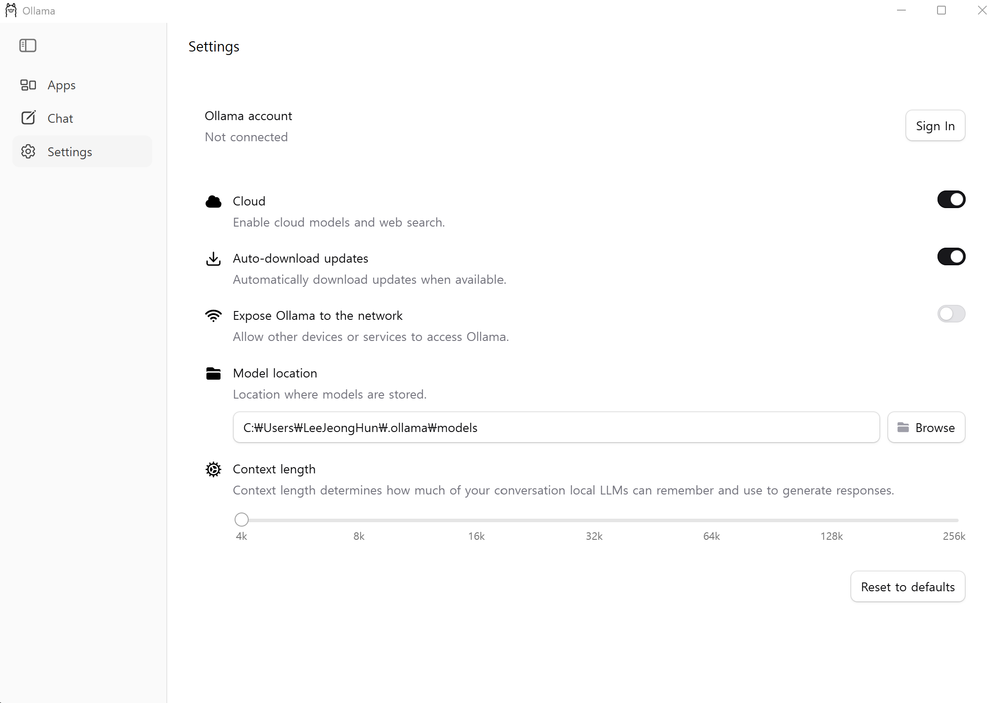

# Local LLM Environment

<br/>

The current Local LLM integration uses Ollama to analyze Pytest CT results. Unittest reports do not use the Local LLM.

<br/>



<br/>

## Local LLM Usage

<br/>

| Item | Current value |
|---|---|
| Runtime | Ollama |
| Default endpoint | `http://127.0.0.1:11434` |
| Default model | `deepseek-r1:7b` |
| Analysis target | Pytest CT result and logs |
| Unittest analysis | Not used |
| Configuration | `test_envs/configs/config.json` → `ollama` |
| Runtime status | `test_envs/configs/check.json` → `ollama` |
| Analysis log | `test_envs/reports/local_llm/<execution-id>_local_llm.log` |

<br/>

## Pytest Analysis

<br/>

```text
Pytest CT result and execution log
                ↓
Normalize result and parse log evidence
                ↓
Select test prompt or default prompt
                ↓
POST /api/generate to the configured Ollama model
                ↓
Validate structured analysis response
                ↓
Write Local LLM log and Pytest Markdown report
```

<br/>

| Prompt source | Priority |
|---|---:|
| Non-empty CT marker `test_prompt` | 1 |
| `ollama.default_prompt` | 2 |

<br/>

The analyzer sends normalized test data, extracted errors, warnings, important log lines, and an optional source diff. The model must return structured JSON containing summary, classification, confidence, warnings, failure analysis, source review, recommendations, and escalation status.

<br/>

### Retry and Fallback

<br/>

| Condition | Behavior |
|---|---|
| Ollama response is valid | Use the Local LLM analysis |
| Request or response validation fails | Retry up to `max_retry` times after the initial attempt |
| All attempts fail | Generate a deterministic fallback analysis |
| Ollama is unavailable | Preserve report generation through the fallback |

<br/>

With the current `max_retry: 3`, the analyzer can make up to four total attempts.

<br/>

## Configuration and Status

<br/>

### Ollama Configuration

<br/>

Source: `test_envs/configs/config.json`

<br/>

```json
{
  "ollama": {
    "url": "http://127.0.0.1:11434",
    "selected_model": "deepseek-r1:7b",
    "default_prompt": "analyze the test result and provide a detailed report with recommendations for improvement.",
    "max_timeout_s": 20,
    "max_retry": 3
  }
}
```

<br/>

| Field | Role |
|---|---|
| `url` | Ollama API endpoint |
| `selected_model` | Model used for pull and analysis |
| `default_prompt` | Fallback when the CT has no `test_prompt` |
| `max_timeout_s` | Timeout for each analysis request |
| `max_retry` | Additional attempts after the first failure |

<br/>

`OLLAMA_URL` and `OLLAMA_MODEL` can override the configured endpoint and model for the current process.

<br/>

### Ollama Status

<br/>

Source: `test_envs/configs/check.json`

<br/>

| Field | Meaning |
|---|---|
| `installed` | Ollama executable was found |
| `executable` | Resolved executable path |
| `version` | Ollama version output |
| `available` | The configured `/api/tags` endpoint responded |
| `endpoint` | Configured Ollama URL |
| `selected_model` | Model selected in project configuration |
| `selected_model_installed` | Selected model exists in the Ollama inventory |
| `supported_models` | Model inventory returned by Ollama |

<br/>

Refresh this generated status instead of manually editing `check.json`.

<br/>

## Runtime Inspection

<br/>

Show the selected endpoint and model:

<br/>

```powershell
.\.venv\Scripts\python.exe -m test_envs.tools.local_llm config
```

<br/>

Show endpoint availability and the installed model inventory:

<br/>

```powershell
.\.venv\Scripts\python.exe -m test_envs.tools.local_llm status
```

<br/>

Refresh the complete project environment status:

<br/>

```powershell
.\.venv\Scripts\python.exe -m test_envs.tools.configuration check
```

<br/>

## VS Code Usage

<br/>

| VS Code entry | Purpose |
|---|---|
| `SETUP 3: Install Ollama and Local LLM` | Installs or detects Ollama and pulls the selected model |
| `CHECK 1: Refresh Environment Check File` | Refreshes Python and Ollama status in `check.json` |
| `CHECK 3: Run Ollama Server (Foreground)` | Runs the local Ollama server in its Task terminal |

<br/>

The server Task is deliberately foreground-owned. Stopping or closing that Task stops the process it owns. No hidden background-server lifecycle is managed by the repository.

<br/>

See [VS Code Environment](vscode_environment.md) for the corresponding Run and Debug and Run Tasks configuration.

<br/>

## Output and Logs

<br/>

| Output | Location | Scope |
|---|---|---|
| Local LLM request log | `test_envs/reports/local_llm/<execution-id>_local_llm.log` | Pytest only |
| Generated Markdown | `test_envs/reports/markdown/` | Processed test reports |
| Published MkDocs result | `docs/tests/pytest/` | Pytest result pages |

<br/>

The Local LLM log records the execution ID, TEST ID, model, endpoint, timeout, retry count, effective prompt, each attempt, and fallback source when used.

<br/>

## Usage Rules

<br/>

| Rule | Reason |
|---|---|
| Create `.venv` before Local LLM setup | Setup and analysis tools run with project Python |
| Configure the model in `config.json` | Model selection is project-owned |
| Run the local server before pulling or analyzing | `/api/tags`, `/api/pull`, and `/api/generate` require a reachable endpoint |
| Keep the server in the foreground Task | Process ownership and shutdown remain visible |
| Use Local LLM analysis only for Pytest | This is the currently implemented reporting path |
| Keep generated logs out of source control | Report outputs are runtime artifacts |

<br/>

## Troubleshooting

<br/>

| Symptom | Check |
|---|---|
| Ollama executable not found | Run the setup command and verify the OS installer is available |
| `Ollama is not reachable` | Start the foreground server and verify `ollama.url` |
| Selected model is missing | Run model setup again to pull `selected_model` |
| Status reports `available: false` | Verify the server and `/api/tags` endpoint |
| Analysis uses `deterministic-fallback` | Inspect the execution-specific Local LLM log for request or validation errors |
| Requests time out | Check model size, system resources, and `max_timeout_s` |

<br/>

## Environment Installation

<br/>

### Requirements

<br/>

| Requirement | Purpose |
|---|---|
| Project `.venv` | Runs the setup and Local LLM tools |
| Supported OS configuration | Selects the platform installer |
| Network access | Installs Ollama and pulls the configured model |
| Local endpoint access | Connects to Ollama through HTTP |
| Windows `winget` | Automatic Windows installation |
| macOS Homebrew | Automatic macOS installation |
| Linux `sh` | Runs the downloaded Ollama installer |

<br/>

Create the Python environment first by following [Python Environment](python_environment.md).

<br/>

### OS Installers

<br/>

| OS | Automatic installation path |
|---|---|
| Windows | `winget install --id Ollama.Ollama --exact` |
| macOS | `brew install ollama` |
| Linux | Download and run `https://ollama.com/install.sh` with `sh` |

<br/>

The installer is used only when the configured endpoint is local and an Ollama executable cannot be found. A remote Ollama endpoint is never installed or started by this project.

<br/>

### Windows PowerShell

<br/>

Start the local server in a dedicated foreground terminal:

<br/>

```powershell
.\.venv\Scripts\python.exe -m test_envs.tools.environment_setup serve --platform config
```

<br/>

Keep that terminal running. In another PowerShell terminal, install or update the selected model:

<br/>

```powershell
.\.venv\Scripts\python.exe -m test_envs.tools.environment_setup ollama --platform config
```

<br/>

Refresh the environment status:

<br/>

```powershell
.\.venv\Scripts\python.exe -m test_envs.tools.configuration check
```

<br/>

### Linux and macOS

<br/>

```bash
./.venv/bin/python -m test_envs.tools.environment_setup serve --platform config
```

<br/>

In another terminal:

<br/>

```bash
./.venv/bin/python -m test_envs.tools.environment_setup ollama --platform config
```

<br/>

```bash
./.venv/bin/python -m test_envs.tools.configuration check
```

<br/>

### Installation Flow

<br/>

```text
Resolve config.json OS and Ollama settings
                ↓
Verify configured OS matches the host OS
                ↓
Locate Ollama executable
                ↓
Install Ollama when the endpoint is local and executable is missing
                ↓
Run the Ollama server in the foreground
                ↓
Read /api/tags model inventory
                ↓
Pull the configured selected_model through /api/pull
                ↓
Refresh check.json
```

<br/>

## Full Local LLM Structure

<br/>

```text
test_envs/
├── configs/
│   ├── config.json                 # Endpoint, model, prompt, timeout, and retry
│   └── check.json                  # Executable, server, and model inventory status
├── tools/
│   ├── environment_setup.py        # Install Ollama, run server, and pull model
│   ├── local_llm/
│   │   ├── __init__.py             # Runtime status and LocalLLMAnalyzer
│   │   └── __main__.py             # config and status CLI
│   ├── log_parser/                 # Extracts errors, warnings, and important logs
│   ├── result_normalizer/           # Provides normalized ResultRecord input
│   └── test_result/                # Connects results, analysis, and reporting
└── reports/
    ├── local_llm/                   # Per-execution Local LLM logs
    └── markdown/                    # Generated report Markdown

docs/
└── tests/pytest/                    # Published Pytest result pages
```

<br/>
