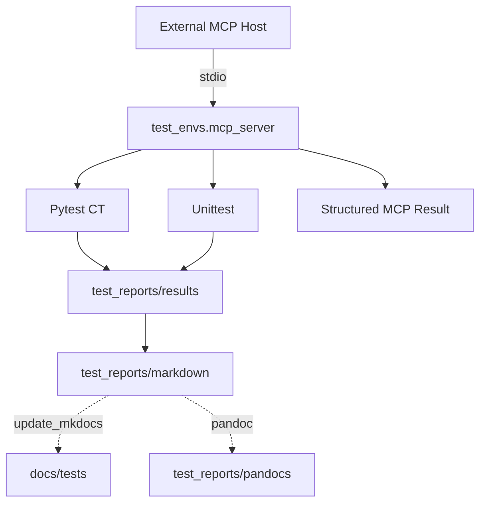

# MCP External Test Execution

<br/>

`test_envs.mcp_server` exposes the repository test pipeline to an external MCP host through the local `stdio` transport.

<br/>

## Exposed Tools

<br/>

| MCP tool | Purpose |
|---|---|
| `get_test_envs` | Checks OS, Python/venv, Ollama/model, Pandoc, and MCP permission flags |
| `get_test_list_pytest` | Reads `test_catalog.json` and lists Pytest TEST IDs, source paths, fixture metadata, modes, and HIL availability |
| `get_test_list_unittest` | Lists Unittest scopes and discovered test files |
| `get_test_list_all` | Returns the combined Pytest and Unittest inventory |
| `get_github_issue_requests` | Lists GitHub test-request Issues whose Test Environment is `Local MCP` |
| `run_github_issue` | Reads one Local MCP Issue, executes it without a GitHub Self-hosted Runner, and posts its generated canonical Markdown |
| `run_test_pytest` | Runs one allowlisted Pytest CT and returns its normalized result and report paths |
| `run_test_unittest` | Runs all Unittest tests, CT Framework Python, or another allowlisted extension scope |
| `run_test_all` | Runs `run_test_pytest` and `run_test_unittest` sequentially |
| `update_latest_result` | Reads the latest normalized result and log and updates Markdown or Pandoc DOCX/HTML outputs |
| `update_mkdocs` | Publishes the latest generated Markdown into `docs/tests` |

<br/>

## Install

<br/>

```powershell
.\.venv\Scripts\python.exe -m pip install -r requirements.txt
```

<br/>

## VS Code MCP

<br/>

The workspace configuration is stored in `.vscode/mcp.json`. Open the Command Palette, run `MCP: List Servers`, and start `ai-driven-ci-ct`.

<br/>

```json
{
  "servers": {
    "ai-driven-ci-ct": {
      "type": "stdio",
      "command": "${workspaceFolder}/.venv/Scripts/python.exe",
      "args": ["-m", "test_envs.mcp_server"],
      "cwd": "${workspaceFolder}",
      "env": {
        "TEST_NAME": "local_01",
        "PYTEST_HIL_ALLOW": "false",
        "MKDOC_UPDATE": "false"
      }
    }
  }
}
```

<br/>

Any MCP host that supports `stdio` can use the same Python command and repository working directory. Standard output is reserved for MCP protocol messages; test process output is captured and returned in the tool result.

<br/>

Set a unique `TEST_NAME` such as `local_01`, `local_02`, or `hil_lab_01` for each installed test server. Results created through this server record `test_request` as `mcp`.

<br/>

## Connection Test

<br/>

Run the protocol contract tests without starting a child process:

<br/>

```powershell
.\.venv\Scripts\python.exe -m pytest -p no:cacheprovider test_envs/tests/unittest/ct_framework/python/test_mcp_runner.py -k "not stdio" -vv
```

<br/>

Run the optional integration test that launches the server as an external `stdio` process:

<br/>

```powershell
$env:AI_CT_RUN_STDIO_TEST = "true"
.\.venv\Scripts\python.exe -m pytest -p no:cacheprovider test_envs/tests/unittest/ct_framework/python/test_mcp_runner.py -k stdio -vv
```

<br/>

## Result Flow

<br/>



<br/>

`markdown` generates the canonical Markdown report. `update_mkdocs` separately copies that generated Markdown into `docs/tests`. Pandoc DOCX uses `docx/reference.docx`.

The MCP Pytest allowlist is loaded from `test_envs/tests/pytest/test_cases/test_catalog.json`. Adding a Python CT case therefore requires no MCP source-code edit; run `python -m test_envs.tools.test_catalog` to register it.

<br/>

GitHub Issue forms can select `Local MCP`. This path does not register or require a GitHub Self-hosted Runner. An MCP client first calls `get_github_issue_requests`, then calls `run_github_issue` with the selected Issue number. The MCP host reads the Issue through the GitHub API, executes it locally, generates the canonical Markdown, and posts that exact Markdown back to the Issue.

<br/>

The MCP process needs `GITHUB_REPOSITORY=owner/repository` and either `GH_TOKEN` or `GITHUB_TOKEN` with Issue read/write access. Keep the token in the MCP host's secure user environment rather than committing it to `.vscode/mcp.json`.

<br/>

## HIL Safety

<br/>

Pytest HIL execution is disabled by default. Enable it only on a machine connected to the intended equipment:

<br/>

```powershell
$env:PYTEST_HIL_ALLOW = "true"
.\.venv\Scripts\python.exe -m test_envs.mcp_server
```

<br/>

`update_mkdocs` is also disabled by default. Set `MKDOC_UPDATE=true` only when the MCP client is allowed to update `docs/tests`.

<br/>

The MCP server does not accept arbitrary pytest paths, node IDs, or shell commands. It only accepts the configured TEST IDs and Unittest scopes. Test calls are serialized to prevent report collisions.

<br/>

## Network Boundary

<br/>

The default server is local `stdio`, so it is available to external MCP applications running on the same machine without opening a TCP port. A remotely hosted Streamable HTTP endpoint requires authentication, TLS, and runner authorization and is intentionally not enabled by this configuration.

<br/>
