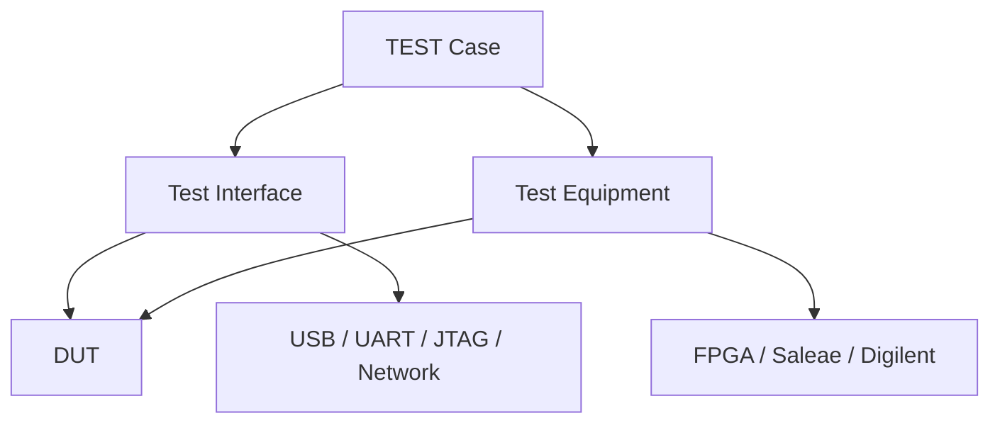
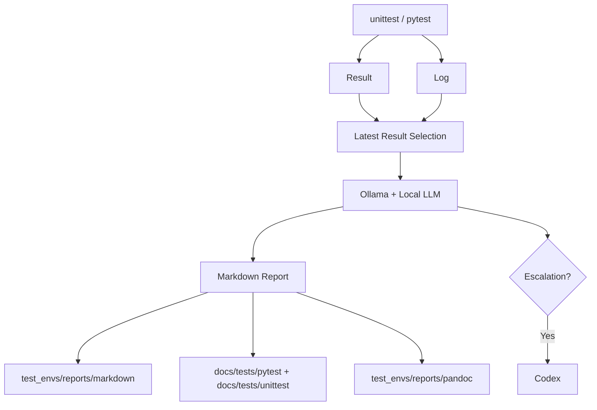

# 동작 구성

## 1. TEST 구조도

| Interface | Test ID | Measurement |
|---|---|---|
| UART | `CT-UART-001` | baudrate, error, jitter |
| USB | `CT-USB-001` | bytes, packets, integrity |
| Network | `CT-NETWORK-001` | bytes, packets, latency, integrity |

| Tool group | Directory | Tools |
|---|---|---|
| Equipment | `test_envs/tests/pytest/test_equipments/` | FPGA, Saleae, Digilent |
| Interface | `test_envs/tests/pytest/test_interfaces/` | USB, UART, JTAG, Network |

| pytest mode | Document |
|---|---|
| HIL / Mock | [Open](hil_mock.md) |

### Repository Structure

```text
.
├── docs/
└── test_envs/
    ├── configs/
    │   ├── config.json
    │   └── check.json
    ├── tests/
    │   ├── pytest/
    │   │   ├── test_cases/test_fixture_<NNN>_<test-content>.py
    │   │   ├── fixtures/
    │   │   ├── test_equipments/{fpga,saleae,digilent}/{mock,hil}/
    │   │   ├── test_interfaces/{usb,uart,jtag,network}/{mock,hil}/
    │   │   └── conftest.py
    │   └── unittest/
    │       ├── ct_framework/python/
    │       ├── python/
    │       ├── c_cpp/
    │       ├── firmware/
    │       └── common/
    ├── reports/
    └── tools/
```

### Layer Structure



### Layer Responsibility

| Layer | 책임 |
|---|---|
| Test Case | Scenario, parameters, assertions |
| Test Interface | DUT communication transport |
| Test Equipment | Measurement and external control |
| Fixture | Connect, initialize, yield, cleanup |
| Result Recorder | `result.json`, `test.log` |

### Interface Contract

```python
connect()
disconnect()
read()
write()
execute()
```

## 2. TEST Result Report 구조도

### ID 정의

| Identifier | Scope | Definition | Purpose | Format |
|---|---|---|---|---|
| TEST ID | pytest only | `test_envs/tests/pytest/test_cases` | Test case identification | `CT-<TARGET>-<NNN>` |
| Execution ID | pytest, unittest | Execution result generation | Result delimiter | `YYYYMMDD_HHMMSS_ffffff` |

| Runner | TEST ID | Execution ID |
|---|---|---|
| pytest | Required | Required |
| unittest | Prohibited | Required |

```text
Execution ID: 20260819_094832_960333
├── Date         20260819  [Config timezone]
├── Time         094832    [Config timezone]
└── Microseconds 960333
```

| Time field | Config source | Rule |
|---|---|---|
| Timezone | `test_envs/configs/config.json` → `time.timezone` | SeoulTime name |
| UTC offset | `test_envs/configs/config.json` → `time.utc_offset_hours` | SeoulTime correction |
| Date·Time | `configured_now()` | Config value application |
| Microseconds | `%f` | 6 digits |

| Output | Rule | Search key |
|---|---|---|
| Result JSON | Execution ID 생성 | Execution ID |
| Test log | 동일 Execution ID | Execution ID |
| Local LLM log | 동일 Execution ID | Execution ID |
| Markdown | 동일 Execution ID | Execution ID |
| Pandoc | 동일 Execution ID | Execution ID |

```text
Execution ID
├── Result JSON
├── Test log
├── Local LLM log
├── Markdown
└── Pandoc
```

### Data Flow



### Runtime Data

```text
test_envs/reports/
├── results/
│   ├── pytest/test_cases/<test-id>/
│   │   ├── <execution-id>_result.json
│   │   └── <execution-id>_test.log
│   └── unittest/
│       ├── <execution-id>_result.json
│       └── <execution-id>_result.log
├── local_llm/
│   └── <execution-id>_local_llm.log
├── pandoc/<test-id>/
│   └── <execution-id>_result.{html,pdf,docx}
└── markdown/
    ├── <test-id>/<execution-id>_result.md
    └── unittest/<execution-id>_result.md
```

### MkDocs Data

```text
docs/
├── index.md
├── environment.md
├── operation.md
└── tests/
    ├── pytest/
    │   ├── index.md
    │   ├── <test-id>.md
    │   └── <test-id>__<execution-id>.md
    └── unittest/
        ├── index.md
        └── <execution-id>.md
```

### Index Responsibility

| File | 구성 | 갱신 방식 |
|---|---|---|
| `docs/index.md` | 문서 링크·시스템 요약 | Manual |
| `docs/environment.md` | 환경 구성 | Manual |
| `docs/operation.md` | 동작 구성 | Manual |
| `docs/tests/pytest/index.md` | pytest 목록·최신 링크·실행 이력 | Automatic |
| `docs/tests/unittest/index.md` | unittest 목록·최신 링크·실행 이력 | Automatic |
| `<test-id>.md` | TEST별 최신 결과 | Automatic |
| `<test-id>__<execution-id>.md` | 실행별 결과 | Append-only |

### Report Generation

```text
python -m test_envs.tools.test_result --pending --docs
├── Pending result selection
├── Local LLM analysis
├── Numeric progress output
├── Canonical Markdown generation
├── Execution snapshot creation
├── Latest TEST page update
└── docs/tests/{pytest,unittest}/index.md update
```

### Local LLM report

| Warning count | Severity |
|---:|---|
| 0–1 | `LOW` |
| 2–3 | `MEDIUM` |
| 4–5 | `HIGH` |
| 6+ | `CRITICAL` |

```text
Local LLM Analysis
├── Classification
├── Confidence
├── Analyzer
├── Status
├── LLM Test Prompt
├── Test Result
│   ├── Status
│   ├── Severity
│   ├── Warnings
│   └── Needs Escalation
└── Test Summary
    ├── Summary
    ├── Failure Analysis
    ├── Source Review
    ├── Warnings
    └── Recommendations
```
