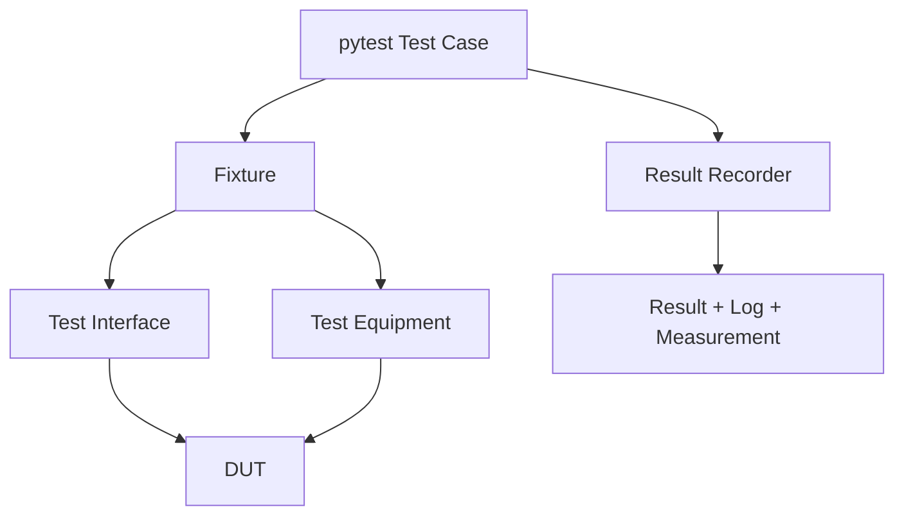

# pytest / Continuous Testing

## Scope

| Area | Coverage |
|---|---|
| Communication | USB, UART, JTAG, Network |
| Timing | Baudrate, jitter, latency, frequency |
| Functional | DUT feature validation |
| Performance | Throughput, response time, load |
| Stability | Repetition, duration, recovery |
| Regression | Previous failure and baseline comparison |

## Communication CT

| Test ID | Interface | Scope |
|---|---|---|
| `CT-USB-001` | USB | Bulk loopback / packetization / integrity |
| `CT-NETWORK-001` | Network | Packet loopback / latency / integrity |

## TEST CASE Registry

| Item | Value |
|---|---|
| File | `test_envs/configs/pytest/test_cases_catalog.json` |
| Key | `test_id` |
| Mode selection | `test_mode` |
| Derived modes | `interface_mode`, `equipment_mode` |
| Validation | pytest collection hook |
| Missing / mismatch | Collection error |

| Registry | Tools |
|---|---|
| `test_envs/configs/pytest/test_equipments_catalog.json` | FPGA, Saleae, Digilent |
| `test_envs/configs/pytest/test_interfaces_catalog.json` | USB, UART, JTAG, Network |

## Structure

```text
test_envs/tests/
├── pytest/
│   ├── test_cases/
│   │   ├── test_fixture_001_uart_timing.py
│   │   ├── test_fixture_002_usb_loopback.py
│   │   └── test_fixture_003_network_loopback.py
│   ├── fixtures/
│   │   ├── fixture_001_uart.py
│   │   ├── fixture_002_uart_saleae.py
│   │   ├── fixture_003_usb_digilent.py
│   │   ├── fixture_004_jtag_fpga.py
│   │   ├── fixture_005_full_hil.py
│   │   └── fixture_006_network.py
│   ├── test_equipments/
│   │   ├── fpga/{mock,hil}/
│   │   ├── saleae/{mock,hil}/
│   │   └── digilent/{mock,hil}/
│   ├── test_interfaces/
│   │   ├── usb/{mock,hil}/
│   │   ├── uart/{mock,hil}/
│   │   ├── jtag/{mock,hil}/
│   │   └── network/{mock,hil}/
│   └── conftest.py
└── unittest/
    ├── ct_framework/
    │   └── python/
    ├── python/
    ├── c_cpp/
    ├── firmware/
    └── common/
```

## Fixture-to-Test Mapping

| Order | Fixture composition | Test case | TEST ID |
|---:|---|---|---|
| 1 | UART + Saleae | `test_fixture_001_uart_timing.py` | `CT-UART-001` |
| 2 | USB + Digilent | `test_fixture_002_usb_loopback.py` | `CT-USB-001` |
| 3 | Network | `test_fixture_003_network_loopback.py` | `CT-NETWORK-001` |

## Execution Model



## Commands

```powershell
.\.venv\Scripts\python.exe -m pytest test_envs/tests/pytest
.\.venv\Scripts\python.exe -m pytest test_envs/tests/pytest -m ct -s
```

## Report Files

| Type | Path |
|---|---|
| Result / Raw | `test_envs/reports/pytest/test_cases/<test-id>/<timestamp>_{result,raw}.json` |
| Measurement | `test_envs/reports/pytest/test_cases/<test-id>/<timestamp>_measurement.{json,csv}` |
| Logs | `test_envs/reports/pytest/test_cases/<test-id>/<timestamp>_<log-name>.log` |
| Markdown | `test_envs/reports/markdown/<test-id>/<timestamp>_result.md` |
| Pandoc | `test_envs/reports/pandoc/<test-id>/<timestamp>_result.<format>` |

## VS Code

- Testing path: `test_envs/tests/pytest`
- Debug: `Debug: Current pytest File`
- Task: `TEST CASE: ALL`
- Task: `TEST CASE: TEST ID` / ID list
