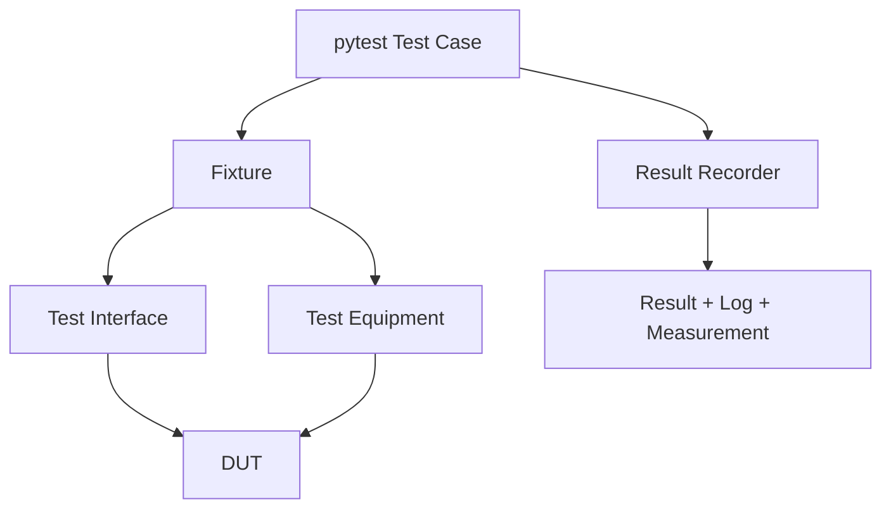

# pytest / Continuous Testing

## Scope

| Area | Coverage |
|---|---|
| Communication | USB, UART, JTAG, Network |
| Timing | Baudrate, jitter, latency, frequency |
| Functional | DUT feature validation |
| Performance | Throughput, response time, load |
| Stability | Repetition, duration, recovery |
| Regression | Previous failure and baseline comparison |

## Communication CT

| Test ID | Interface | Scope |
|---|---|---|
| `CT-USB-001` | USB | Bulk loopback / packetization / integrity |
| `CT-NETWORK-001` | Network | Packet loopback / latency / integrity |

## TEST CASE Registry

| Item | Value |
|---|---|
| File | `tests/pytest/test_cases/catalog.json` |
| Key | `test_id` |
| Validation | pytest collection hook |
| Missing / mismatch | Collection error |

| Registry | Tools |
|---|---|
| `test_equipments/catalog.json` | Saleae, Digilent |
| `test_interfaces/catalog.json` | UART, USB, Network |

## Structure

```text
tests/pytest/
├── test_cases/
├── test_equipments/
├── test_interfaces/
└── conftest.py
```

## Execution Model



## Commands

```powershell
.\.venv\Scripts\python.exe -m pytest tests/pytest
.\.venv\Scripts\python.exe -m pytest tests/pytest -m ct -s
```

## VS Code

- Testing path: `tests/pytest`
- Debug: `Debug: Current pytest File`
- Task: `TEST 2: Run Continuous Tests`
