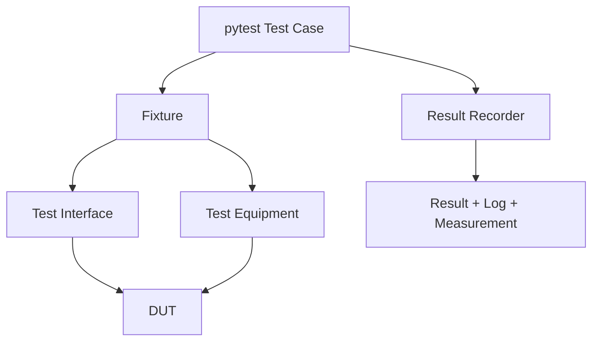

# pytest / Continuous Testing

## Scope

| Area | Coverage |
|---|---|
| Communication | USB, UART, JTAG, Network |
| Timing | Baudrate, jitter, latency, frequency |
| Functional | DUT feature validation |
| Performance | Throughput, response time, load |
| Stability | Repetition, duration, recovery |
| Regression | Previous failure and baseline comparison |

## Structure

```text
tests/pytest/
├── test_cases/
├── test_equipments/
├── test_interfaces/
└── conftest.py
```

## Execution Model



## Commands

```powershell
.\.venv\Scripts\python.exe -m pytest tests/pytest
.\.venv\Scripts\python.exe -m pytest tests/pytest -m ct -s
```

## VS Code

- Testing path: `tests/pytest`
- Debug: `Debug: Current pytest File`
- Task: `Test: Run Continuous Tests`

