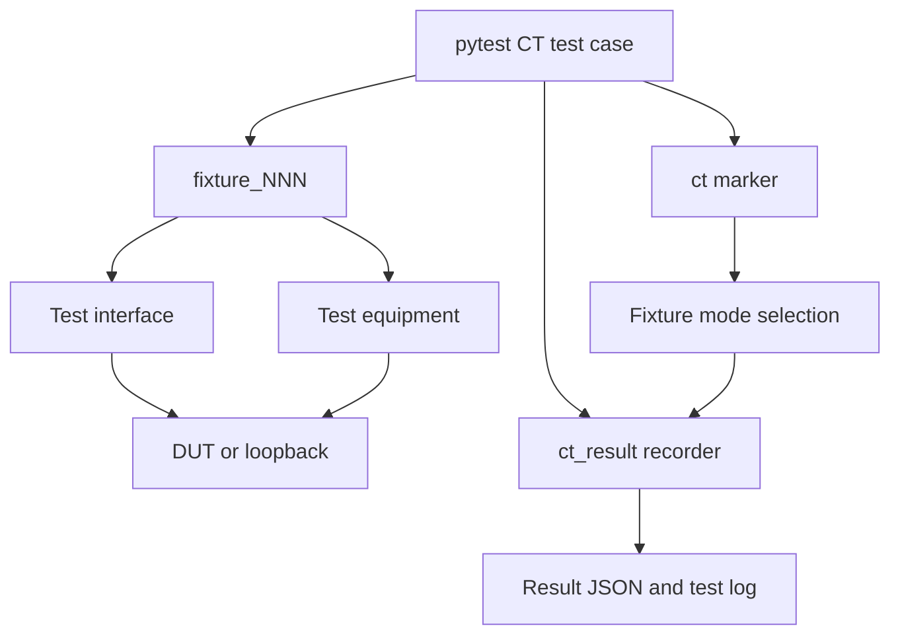

# Pytest CT Framework

## Scope

The pytest area runs continuous tests (CT) that combine a test case,  
a fixture composition, DUT interfaces, and optional measurement or control   equipment.    
Every pytest CT execution resolves to one of two modes: `mock` or `hil`.

<br/>

| Area | Current coverage |
|---|---|
| Communication | USB, JTAG, and Network , UART transport |
| Timing | UART baudrate error and jitter |
| Available tool implementations | USB, UART, JTAG, Network; FPGA, Saleae, Digilent |
| Result capture | Status, duration, configuration, metrics, statistics, source revision, logs |
| Runner | pytest only; unittest does not use the fixture-mode contract |

## Architecture

<br/>



| Layer | Location | Responsibility |
|---|---|---|
| Test case | `test_envs/tests/pytest/test_cases/` | Scenario, assertions, CT marker, metrics/statistics |
| Fixture composition | `test_envs/tests/pytest/fixtures/` | Tool selection, connection lifecycle, supported modes |
| DUT interface | `test_envs/tests/pytest/test_interfaces/` | `connect`, `disconnect`, `read`, `write`, `execute` |
| Test equipment | `test_envs/tests/pytest/test_equipments/` | Measurement or DUT control |
| Framework hooks | `test_envs/tests/pytest/conftest.py` | Registry, validation, selection, result/log generation |

## Repository Structure

<br/>

```text
test_envs/tests/
├── pytest/                       # CT execution mode: mock or hil
│   ├── test_cases/
│   │   ├── test_fixture_001_uart_timing.py
│   │   ├── test_fixture_002_usb_loopback.py
│   │   └── test_fixture_003_network_loopback.py
│   ├── fixtures/
│   │   ├── fixture_001_uart_saleae.py
│   │   ├── fixture_002_usb_digilent.py
│   │   ├── fixture_003_network.py
│   │   ├── fixture_004_jtag_fpga.py
│   │   └── fixture_005_full_hil.py
│   ├── test_equipments/
│   │   ├── hil_base.py
│   │   ├── fpga/{mock,hil}/
│   │   ├── saleae/{mock,hil}/
│   │   └── digilent/{mock,hil}/
│   ├── test_interfaces/
│   │   ├── base.py
│   │   ├── hil_base.py
│   │   ├── usb/{mock,hil}/
│   │   ├── uart/{mock,hil}/
│   │   ├── jtag/{mock,hil}/
│   │   └── network/{mock,hil}/
│   └── conftest.py
└── unittest/
    ├── ct_framework/
    │   └── python/
    ├── python/
    ├── c_cpp/
    ├── firmware/
    └── common/
```

## Identifiers and Test Cases

<br/>

| Identifier | Rule | Example |
|---|---|---|
| TEST ID | Unique, non-empty marker value without spaces | `CT-UART-001` |
| Fixture ID | Test filename number and fixture metadata must agree | `FIXTURE-001` |
| Fixture argument | Must use the same three-digit number | `fixture_001` |
| Execution ID | Generated for every result | `YYYYMMDD_HHMMSS_ffffff` |

<br/>

### Current executable CT mapping

<br/>

| Fixture | Composition | Test case | TEST ID | Category | Default mode |
|---|---|---|---|---|---|
| `FIXTURE-001` | UART + Saleae | `test_fixture_001_uart_timing.py` | `CT-UART-001` | `timing` | `mock` |
| `FIXTURE-002` | USB + Digilent | `test_fixture_002_usb_loopback.py` | `CT-USB-001` | `communication` | `mock` |
| `FIXTURE-003` | Network | `test_fixture_003_network_loopback.py` | `CT-NETWORK-001` | `communication` | `mock` |

`FIXTURE-004` and `FIXTURE-005` are registered metadata/fixture scaffolds,        
but there are no matching `test_fixture_004_*.py` or `test_fixture_005_*.py` CT test cases.

<br/>

## CT Marker Contract

<br/>

```python
@pytest.mark.ct(
    test_id="CT-UART-001",
    category="timing",
    fixture_id="FIXTURE-001",
    fixture_mode="mock",
    test_prompt="",
)
```

| Field | Required | Owner | Purpose |
|---|---:|---|---|
| `test_id` | Yes | Test case | Unique TEST ID and `--test-id` selection |
| `category` | Yes | Test case | Result classification |
| `fixture_id` | Yes | Test case | Fixture metadata mapping |
| `fixture_mode` | Yes | Test case | Default `mock` or `hil` mode |
| `test_prompt` | No | Test case | Local LLM prompt override; an empty value uses the configured default |
| `description` | No | Test case | Result description; the function name is the fallback |

Collection performs the following validation for every CT item:

- Required marker fields exist.
- `test_id` is a non-empty string and is not duplicated.
- A file named `test_fixture_<NNN>_*.py` declares `fixture_id="FIXTURE-<NNN>"`.
- The test function requests `fixture_<NNN>`.
- The fixture ID exists in the registry.
- `fixture_mode` is `mock` or `hil`, and that mode is enabled in `FIXTURE_META`.

An invalid contract raises a pytest collection/usage error before test execution.

## Fixture Registry and Metadata

<br/>

`fixture_registry()` imports every `fixture_*.py` module in the fixtures package and reads its `FIXTURE_META` mapping.      
Registry validation therefore applies even to fixture scaffolds that do not yet have test cases.

```python
FIXTURE_META = {
    "fixture_id": "FIXTURE-001",
    "interfaces": ["UART"],
    "equipments": ["Saleae"],
    "modes": {
        "mock": {"enabled": True},
        "hil": {"enabled": True},
    },
}
```

| Field | Validation |
|---|---|
| `fixture_id` | Unique, non-empty `str` |
| `interfaces` | `list[str]`; an empty list is allowed |
| `equipments` | `list[str]`; an empty list is allowed |
| `modes` | Mapping containing both `mock` and `hil` |
| `modes.<mode>.enabled` | `bool` |

### Registered fixture catalog

<br/>

| Fixture | Interfaces | Equipment | Mock declared | HIL declared | Current integration state |
|---|---|---|---:|---:|---|
| `FIXTURE-001` | UART | Saleae | Yes | Yes | Mock executable; HIL fixture explicitly fails |
| `FIXTURE-002` | USB | Digilent | Yes | Yes | Mock executable; HIL fixture explicitly fails |
| `FIXTURE-003` | Network | None | Yes | Yes | Mock executable; HIL fixture explicitly fails |
| `FIXTURE-004` | JTAG | FPGA | Yes | No | Mock component fixtures only; no CT test case |
| `FIXTURE-005` | None | None | No | Yes | `CICT_HIL=1` gate scaffold; no CT test case |

`enabled: true` declares that a mode may be selected. It does not prove that the fixture has been wired to physical hardware. The current repository has no end-to-end executable HIL CT test case.

<br/>

## Fixture-Based Test Case Composition

<br/>

A CT Test Case does not create hardware or communication objects directly. It requests one numbered fixture, and that fixture composes the required interfaces and equipment for the selected test topology.

<br/>

```text
Test Case
   ├── @pytest.mark.ct
   │   ├── TEST ID
   │   ├── Fixture ID
   │   └── Default mock or hil mode
   ├── fixture_<NNN>
   │   ├── Interface: DUT communication and data transfer
   │   ├── Equipment: measurement, capture, or target control
   │   └── connect → yield → disconnect lifecycle
   └── ct_result
       ├── metrics: interface and protocol measurements
       └── statistics: equipment observations
```

<br/>

| Layer | Responsibility | Examples |
|---|---|---|
| Test Case | Defines stimulus, assertions, TEST ID, category, and result values | UART timing, USB loopback, Network packet loopback |
| Fixture | Defines the reusable test topology and resource lifecycle | UART + Saleae, USB + Digilent |
| Interface | Communicates with the DUT or protocol endpoint | UART, USB, JTAG, Network |
| Equipment | Measures, captures, programs, or controls the test environment | Saleae, Digilent, FPGA |
| Result recorder | Separates interface metrics from equipment statistics | `ct_result.metrics`, `ct_result.statistics` |

<br/>

### Current Fixture and Test Case Behavior

<br/>

| Fixture | Test Case status | Interface action | Equipment action | Recorded result |
|---|---|---|---|---|
| `FIXTURE-001` | Executable as `CT-UART-001` | UART writes and reads a timing probe | Saleae measures UART timing | Baudrate error and jitter metrics; Saleae statistics |
| `FIXTURE-002` | Executable as `CT-USB-001` | USB performs a 256-byte loopback | Digilent measures the USB transfer | Bytes, packets, endpoint, voltage, and integrity data |
| `FIXTURE-003` | Executable as `CT-NETWORK-001` | Network performs a packet loopback | No equipment is currently composed | Bytes, packet count, latency, host, and port |
| `FIXTURE-004` | Extension fixture; no CT Test Case | JTAG mock connection and transfer | FPGA connection and programmed-image tracking | Available for a future FPGA/JTAG Test Case |
| `FIXTURE-005` | HIL gate; no CT Test Case | No interface | No equipment | Skips unless `CICT_HIL=1` |

<br/>

The numbered contract connects the files and runtime objects: `test_fixture_001_*.py` must declare `FIXTURE-001` and request `fixture_001`. Collection stops before execution if the number, marker metadata, fixture argument, or registry entry does not agree.

<br/>

### Equipment Extension

<br/>

FPGA, Saleae, and Digilent are equipment adapters. Each equipment type owns separate `mock/` and `hil/` implementations so a fixture can keep the same Test Case contract while changing the runtime backend.

<br/>

```text
test_equipments/
├── fpga/{mock,hil}/
├── saleae/{mock,hil}/
├── digilent/{mock,hil}/
└── wireshark/{mock,hil}/            # Planned extension
```

<br/>

Wireshark should be added as Network capture equipment, not as a replacement for `NetworkInterface`. The Network interface continues to send and receive DUT traffic; the Wireshark equipment adapter starts capture, stops capture, and converts packet observations into fixture statistics.

<br/>

A future Wireshark CT extension can use this structure:

<br/>

```text
test_envs/tests/pytest/
├── test_equipments/wireshark/{mock,hil}/
├── fixtures/fixture_006_network_wireshark.py
└── test_cases/test_fixture_006_network_capture.py
```

<br/>

The extension must add `Wireshark` to `FIXTURE_META.equipments`, declare both mode flags, keep capture cleanup in `finally`, and record capture statistics through `ct_result.statistics`. HIL availability must fail or skip explicitly and must never fall back silently to mock behavior.

<br/>

## Mock and HIL Mode Selection

<br/>

```text
pytest CT
├── mock    # Simulation or loopback implementation
└── hil     # Physical hardware implementation
```

<br/>

| Priority | Source | Values |
|---:|---|---|
| 1 | CLI override | `--fixture-mode=mock`, `--fixture-mode=hil` |
| 2 | CT marker default | `fixture_mode="mock"`, `fixture_mode="hil"` |

`--fixture-mode=marker` is the CLI default, but `marker` is not an execution mode.   
It means “use the `mock` or `hil` value declared by the CT marker.”      `effective_fixture_mode()` resolves the final mode and verifies that it is enabled by the fixture metadata.   

`none` is also not a pytest execution mode.     
It is used only for result fields such as `equipment_mode` when a fixture has no equipment.

| Result field | Value source |
|---|---|
| `test_mode` | Effective fixture mode |
| `interface_mode` | Effective fixture mode |
| `equipment_mode` | Effective fixture mode, or `none` when the equipment list is empty |
| `interfaces` / `equipments` | `FIXTURE_META` snapshot |
| `modes` | `FIXTURE_META.modes` snapshot |

### Mock behavior

<br/>

| Tool | Current behavior |
|---|---|
| UART | Connected-state checks, byte loopback, baudrate transmission history |
| USB | Connected-state checks, byte loopback, endpoint and packet-count history |
| Network | Host/port validation, byte loopback, packet and latency history |
| JTAG | Connected-state checks and byte loopback |
| Saleae | UART sample statistics, baudrate error, jitter |
| Digilent | USB bytes, packets, packet size, bus voltage, integrity error |
| FPGA | Connected-state check and programmed-image tracking |

<br/>

### HIL adapters and gate

<br/>

`HILTransportInterface` delegates connection and I/O to injected handlers and rejects reads/writes while disconnected. `HILEquipmentController` similarly delegates equipment connect/disconnect operations. The UART, USB, JTAG, Network, Saleae, Digilent, and FPGA HIL classes currently inherit these generic adapters without device-specific logic.

A completed HIL fixture must:

- Enable `modes.hil.enabled` only when HIL selection is intended.
- Instantiate the HIL interface/equipment with real handlers.
- Connect every configured interface and equipment before yielding.
- Disconnect resources in a `finally` block.
- Fail or skip explicitly if hardware or configuration is unavailable.
- Never fall back silently to a mock implementation.

`full_hil` is an independent gate scaffold and skips unless `CICT_HIL=1`; it is not currently connected to a `fixture_005` CT test case.

## Interface Lifecycle

All DUT transports implement this contract:

```python
connect()
disconnect()
read(size=-1)
write(data)
execute(command)
```

`TestInterface` also supports a context manager. Its default `execute()` encodes a command, writes it, and returns one read. Current composed fixtures connect tools before `yield` and disconnect them in reverse order in `finally`.

## Result Recording

Tests receive `ct_result: CTResultRecorder` and add measurement data explicitly:

```python
ct_result.metrics.update(measurement.metrics())
ct_result.statistics.update(measurement.statistics())
```

After the test call, the fixture creates a normalized `ResultRecord`.

| Result section | Contents |
|---|---|
| `test_case` | ID, status, category, duration, description, environment |
| `test_configs` | CT marker fields except `test_id` and `description` |
| `fixture_configs` | Fixture ID, effective modes, tools, mode declarations |
| `test_src` | Git commit and branch |
| `test_result` | Execution ID, timestamp, metrics, statistics, log name |

Status is `PASS`, `FAIL`, or `SKIP` from the pytest call report. The environment is `github_local_runner` when `GITHUB_ACTIONS=true`, otherwise `local`; runner name comes from `RUNNER_NAME` or defaults to `local`.

The generated test log contains these sections:

```text
[TEST]
[STDOUT]
[STDERR]
[EQUIPMENT]
[INTERFACE]
```

Statistics are written to `EQUIPMENT`; metrics are written to `INTERFACE`.

## Commands

<br/>

* pytest.ini
```
[pytest]
testpaths = test_envs/tests
python_files = test_*.py
addopts = -ra
markers =
    ct: continuous/integration test
    hardware: test requiring real hardware
```
<br/>

* Powershell  
Python Command Examples in venv   

All configured tests under pytest.ini testpaths
```powershell
.\.venv\Scripts\python.exe -m pytest
```

pytest CT area only
```
.\.venv\Scripts\python.exe -m pytest test_envs/tests/pytest -m ct -s
```
Keep each test marker's default mode
```
.\.venv\Scripts\python.exe -m pytest test_envs/tests/pytest/test_cases --fixture-mode=marker
```

Force Mock mode
```
.\.venv\Scripts\python.exe -m pytest test_envs/tests/pytest/test_cases --fixture-mode=mock
```

**Select one TEST ID**     
VSCode -> Task   
VSCode -> Testing
```
.\.venv\Scripts\python.exe -m pytest test_envs/tests/pytest/test_cases --test-id CT-UART-001 --fixture-mode=mock
```

<br/>

For the current three CT test cases,    
forcing `--fixture-mode=hil` fails with an explicit “HIL implementation is required” message.

<br/>

## VS Code

<br/>

| Item | Value |
|---|---|
| Testing path | `test_envs/tests/pytest` |
| Debug configuration | Not currently configured in `launch.json` |
| All-test task | `TEST CASE: ALL` |
| TEST ID task | `TEST CASE: TEST ID` |
| Mode picker | `marker`, `mock`, `hil` |

<br/>

## Report

<br/>

Pytest and unittest connect to the same Markdown-first Report pipeline. Pytest adds Local LLM analysis and conditional escalation before the shared Markdown is generated.

<br/>

```text
Pytest result JSON + test log
              ↓
test_envs.tools.test_result
              ↓
Local LLM analysis + escalation decision
              ↓
test_envs.tools.mkdocs_reporter
              ↓
Canonical Markdown
       ┌──────┴──────┐
       ↓             ↓
MkDocs Results   Pandoc Report
```

<br/>

| Report stage | Source or tool | Output |
|---|---|---|
| Test evidence | `test_envs/reports/results/pytest/test_cases/<test-id>/` | `<execution-id>_result.json` and `<execution-id>_test.log` |
| Analysis | `test_envs.tools.local_llm` | Analysis stored in result JSON and Local LLM log |
| Report coordination | `test_envs.tools.test_result` | Processes the latest or every pending result |
| Canonical Markdown | `test_envs.tools.mkdocs_reporter` | `test_envs/reports/markdown/<test-id>/<execution-id>_result.md` |
| MkDocs publication | `test_envs.tools.mkdocs_reporter` | `docs/tests/pytest/<test-id>.md` and execution pages |
| Pandoc conversion | `test_envs.tools.pandoc_reporter` | `test_envs/reports/pandoc/<test-id>/<execution-id>_result.<format>` |

<br/>

Generate pending Markdown and publish MkDocs result pages:

<br/>

```powershell
.\.venv\Scripts\python.exe -m test_envs.tools.test_result --pending --docs
```

<br/>

Convert the latest Markdown to HTML:

<br/>

```powershell
.\.venv\Scripts\python.exe -m test_envs.tools.pandoc_reporter --latest --format html
```

<br/>

Convert the latest Markdown to DOCX:

<br/>

```powershell
.\.venv\Scripts\python.exe -m test_envs.tools.pandoc_reporter --latest --format docx
```

<br/>

The same commands are available from VS Code through [Run and Debug-Report](vscode_environment.md#run-and-debug-report) and [Tasks-Report](vscode_environment.md#tasks-report). Pytest result pages are published under [Pytest Results](tests/pytest/index.md).

<br/>
