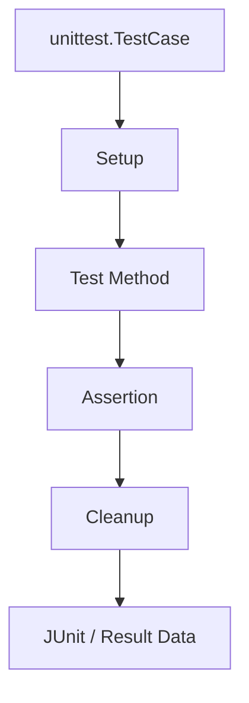

# unittest

## Scope

| Area | Coverage |
|---|---|
| Python | Function, class, module, mock |
| C/C++ | Native unit-test extension |
| Firmware | Hardware-independent firmware logic |
| Common | Shared fixtures, data, utilities |

## Structure

```text
tests/unittest/
├── python/
├── c_cpp/
├── firmware/
└── common/
```

## Execution Model



## Commands

```powershell
.\.venv\Scripts\python.exe -m unittest discover -v -s tests/unittest -p "test_*.py"
.\.venv\Scripts\python.exe -m pytest tests/unittest
```

## VS Code

- Testing path: `tests/unittest`
- Implementation: `unittest.TestCase`
- Task: `Test: Run unittest Suite`

