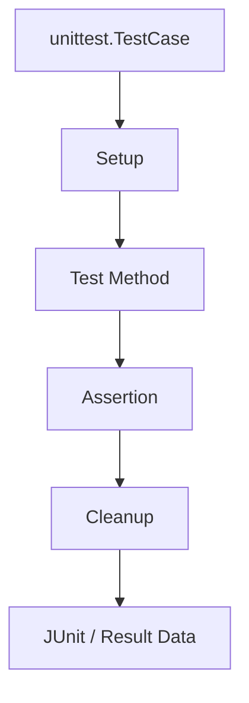

# unittest

## Scope

| Area | Coverage |
|---|---|
| CT Framework | Configuration, tools, reports, mocks, VS Code contract |
| Python | Function, class, module, mock |
| C/C++ | Native unit-test extension |
| Firmware | Hardware-independent firmware logic |
| Common | Shared fixtures, data, utilities |

## Structure

```text
test_envs/tests/unittest/
├── ct_framework/
│   └── python/
├── python/
├── c_cpp/
├── firmware/
└── common/
```

## Execution Model



## Commands

```powershell
.\.venv\Scripts\python.exe -m unittest discover -v -s test_envs/tests/unittest -p "test_*.py"
.\.venv\Scripts\python.exe -m pytest test_envs/tests/unittest
```

## Report Files

| Type | Path |
|---|---|
| Result | `test_envs/reports/results/unittest/<test-id>/<timestamp>_result.json` |
| Log | `test_envs/reports/results/unittest/<test-id>/<timestamp>_test.log` |
| Markdown | `test_envs/reports/markdown/<test-id>/<timestamp>_result.md` |
| Pandoc | `test_envs/reports/pandoc/<test-id>/<timestamp>_result.<format>` |

## VS Code

- Testing path: `test_envs/tests/unittest`
- Implementation: `unittest.TestCase`
- VS Code Testing: pytest adapter
