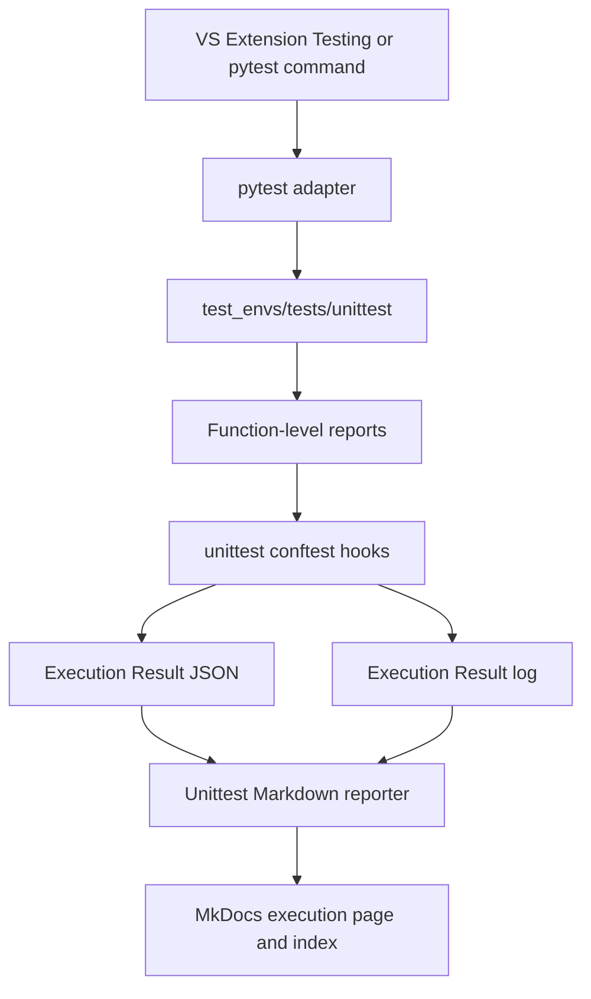

# unittest Framework

<br/>

## Scope

The unittest area validates the CT framework and provides extension points for product-level Python, C/C++, firmware, and shared tests. Tests may use `unittest.TestCase`, but VS Code and the project command run them through the pytest adapter so that the repository result hook is applied.

| Item | unittest rule |
|---|---|
| Result unit | Test function or method |
| Execution unit | One pytest session over the unittest tree |
| Primary identifier | Execution ID |
| TEST ID | Not used or serialized |
| Fixture ID / mode | Not used or serialized |
| Function statuses | `PASS`, `FAIL`, `ERROR`, `SKIP` |
| Local LLM | Not used |
| Output | Result JSON, result log, Markdown, MkDocs execution page |

<br/>

## Architecture



The unittest branch does not call Ollama, create a Local LLM log, add `test_analysis`, or evaluate Codex escalation.

<br/>

## Repository Structure

```text
test_envs/tests/unittest/
├── conftest.py
├── ct_framework/
│   └── python/
│       ├── test_configuration.py
│       ├── test_environment_setup.py
│       ├── test_extension_runner.py
│       ├── test_fixture_contract.py
│       ├── test_issue_parser.py
│       ├── test_latest_result.py
│       ├── test_local_llm.py
│       ├── test_log_parser.py
│       ├── test_markdown_reporter.py
│       ├── test_mock_digilent.py
│       ├── test_mock_network.py
│       ├── test_mock_uart.py
│       ├── test_mock_usb.py
│       ├── test_pandoc_reporter.py
│       ├── test_reporting.py
│       ├── test_repository_structure.py
│       ├── test_result_normalizer.py
│       └── test_vscode_local_llm_contract.py
├── python/
├── c_cpp/
├── firmware/
└── common/
```

| Directory | Role | Current state |
|---|---|---|
| `ct_framework/python/` | Unit tests for framework configuration, fixtures, mocks, reporting, LLM, and VS Code contracts | Implemented |
| `python/` | Product Python unit-test extension | Reserved extension directory |
| `c_cpp/` | C/C++ unit-test integration extension | Reserved extension directory |
| `firmware/` | Firmware unit-test integration extension | Reserved extension directory |
| `common/` | Shared unit-test data and helpers | Reserved extension directory |

<br/>

## Execution

<br/>

### Project command

```powershell
.\.venv\Scripts\python.exe -m pytest -p no:cacheprovider test_envs/tests/unittest
```

<br/>

### VS Code Testing

| Setting | Value |
|---|---|
| Adapter | pytest |
| Discovery root | `test_envs/tests/unittest` |
| Native unittest adapter | Disabled |
| Result capture | `test_envs/tests/unittest/conftest.py` |

Running `python -m unittest` bypasses the pytest hooks and therefore does not generate this framework's normalized result or log.

<br/>

### GitHub Actions

`continuous-test.yml` selects the Unit Test path when the parsed request type is `Unit Test`:

```text
pytest test_envs/tests/unittest --junitxml=<runner-temp>/unit-junit.xml
              ↓
unittest conftest session result
              +
explicit JUnit normalization
              ↓
pipeline --docs
              ↓
Markdown + uploaded evidence
```

The current workflow uses both the unittest pytest hook and a separate `result_normalizer` call for the JUnit XML. Consequently, a GitHub Unit Test run can create an execution record from each capture path.

<br/>

## Result Capture Lifecycle

Source: `test_envs/tests/unittest/conftest.py`

<br/>

### Function capture

The `pytest_runtest_logreport` hook accepts only node IDs under `test_envs/tests/unittest/`. Results are stored by full pytest node ID and written in sorted order when the session finishes.

| pytest phase | Condition | Function status | Failure detail |
|---|---|---|---|
| Setup | Failed | `ERROR` | Setup traceback |
| Setup | Skipped | `SKIP` | Empty |
| Call | Passed | `PASS` | Empty |
| Call | Failed | `FAIL` | Call traceback |
| Call | Skipped | `SKIP` | Empty |
| Teardown | Failed | `ERROR` | Teardown traceback |

A teardown error replaces the earlier function result and adds teardown duration to the previously captured duration.

<br/>

### Session result

| Field | Derivation |
|---|---|
| Status | `ERROR` if any function errored; otherwise `FAIL` if any failed; otherwise `PASS` |
| Duration | Sum of captured function durations |
| Environment | `github_local_runner` when `GITHUB_ACTIONS=true`; otherwise `local` |
| Runner | `RUNNER_NAME`; fallback `local` |
| Commit / branch | CI environment variables or local Git |
| Timestamp / Execution ID | Project-configured time |

If no unittest function report is captured, the session hook does not create result files. A session containing only skipped functions currently has overall status `PASS`, while each function retains `SKIP`.

<br/>

## Result Files

Unlike pytest CT, unittest results are flat because they are keyed only by Execution ID.

```text
test_envs/reports/results/unittest/
├── <execution-id>_result.json
└── <execution-id>_result.log
```

| File | Contents |
|---|---|
| `<execution-id>_result.json` | Execution metadata, summary counts, and function records |
| `<execution-id>_result.log` | Execution summary, function status lines, and failure details |

<br/>

### Result JSON schema

```text
execution
├── execution_id
├── timestamp
├── status
├── duration
├── environment
├── runner
├── commit
├── branch
└── logs
summary
├── total
├── passed
├── failed
├── errors
└── skipped
test_functions[]
├── path
├── function
├── pass
├── status
├── duration
└── failure
```

| Function field | Rule |
|---|---|
| `path` | Source path before the first `::`, normalized to `/` |
| `function` | Final component of the pytest node ID |
| `pass` | `true` only when `status == "PASS"` |
| `status` | Authoritative `PASS`, `FAIL`, `ERROR`, or `SKIP` value |
| `duration` | Captured pytest phase duration in seconds |
| `failure` | Failure/error traceback; otherwise empty |

<br/>

### Result log schema

```text
[execution]
execution_id=...
timestamp=...
status=...
total=...
passed=...
failed=...
errors=...
skipped=...

[test_functions]
PASS | <function> | duration=<seconds>s

[failed_functions]
<function> | FAIL or ERROR
<failure detail>
```

The `[failed_functions]` section is emitted only when at least one function has `FAIL` or `ERROR` status.

<br/>

## Markdown and MkDocs

Generate every pending execution report and publish the MkDocs pages with:

```powershell
.\.venv\Scripts\python.exe -m test_envs.tools.test_result --pending --docs
```

```text
test_envs/reports/results/unittest/<execution-id>_result.json
                         ↓
test_envs/reports/markdown/unittest/<execution-id>_result.md
                         ↓
docs/tests/unittest/<execution-id>.md
                         ↓
docs/tests/unittest/index.md
```

| Output | Rule |
|---|---|
| Canonical Markdown | One file per Execution ID |
| MkDocs execution page | One file per Execution ID |
| Latest summary | Generated in the unittest index |
| Recent executions | Generated in the unittest index |
| Local LLM analysis section | Not generated |

<br/>

### Markdown sections

```text
# unittest Result
└── Test Summary
    ├── Execution summary
    ├── Test Functions
    │   ├── PATH directory mapping
    │   └── Function result table
    ├── Failed Functions
    ├── Test Source
    └── Logs
```

The function table's `Pass` column is a simplified Boolean display: `PASS` when `test_functions[].pass` is true and `FAIL` otherwise. Use the JSON `status` field for the authoritative distinction between `FAIL`, `ERROR`, and `SKIP`; skipped functions are excluded from the Markdown Failed Functions table.

<br/>

### Index columns

| Section | Column | Source |
|---|---|---|
| Unit Tests | Test Function Count | Latest `summary.total` |
| Unit Tests | Pass | Latest execution status |
| Unit Tests | Latest | Latest timestamp and execution-page link |
| Recent Executions | Execution ID | Execution-page link |
| Recent Executions | Result | Execution status |
| Recent Executions | Tests | `summary.total` |
| Recent Executions | Passed | `summary.passed` |
| Recent Executions | Failed | `summary.failed + summary.errors` |

<br/>

## Pytest CT Comparison

| Capability | unittest | pytest CT |
|---|---:|---:|
| Function/method result | Yes | Test-case result |
| TEST ID | No | Yes |
| Fixture ID | No | Yes |
| Mock/HIL mode | No | Yes |
| Metrics/statistics | No dedicated schema | Yes |
| Local LLM | No | Yes |
| Codex escalation | No | Conditional |
| Primary result key | Execution ID | TEST ID + Execution ID |

<br/>

## Related Documents

| Scope | Document |
|---|---|
| Unittest operation | [unittest_operation.md](unittest_operation.md) |
| Unittest results | [tests/unittest/index.md](tests/unittest/index.md) |
| Pytest CT comparison | [pytest_framework.md](pytest_framework.md) |

<br/>

## Report

<br/>

Unittest and Pytest connect to the same Markdown-first Report pipeline. Unittest bypasses Local LLM analysis and escalation, then uses the shared Markdown, MkDocs, and Pandoc reporters.

<br/>

```text
Unittest result JSON + result log
                ↓
test_envs.tools.test_result
                ↓
Local LLM and escalation: not used
                ↓
test_envs.tools.mkdocs_reporter
                ↓
Canonical Markdown
       ┌────────┴────────┐
       ↓                 ↓
MkDocs Results       Pandoc Report
```

<br/>

| Report stage | Source or tool | Output |
|---|---|---|
| Test evidence | `test_envs/reports/results/unittest/` | `<execution-id>_result.json` and `<execution-id>_result.log` |
| Analysis | Not used for unittest | No Local LLM analysis or escalation |
| Report coordination | `test_envs.tools.test_result` | Processes the latest or every pending result |
| Canonical Markdown | `test_envs.tools.mkdocs_reporter` | `test_envs/reports/markdown/unittest/<execution-id>_result.md` |
| MkDocs publication | `test_envs.tools.mkdocs_reporter` | `docs/tests/unittest/<execution-id>.md` and index page |
| Pandoc conversion | `test_envs.tools.pandoc_reporter` | `test_envs/reports/pandoc/unittest/<execution-id>_result.<format>` |

<br/>

Generate pending Markdown and publish MkDocs result pages:

<br/>

```powershell
.\.venv\Scripts\python.exe -m test_envs.tools.test_result --pending --docs
```

<br/>

Convert the latest Markdown to HTML:

<br/>

```powershell
.\.venv\Scripts\python.exe -m test_envs.tools.pandoc_reporter --latest --format html
```

<br/>

Convert the latest Markdown to DOCX:

<br/>

```powershell
.\.venv\Scripts\python.exe -m test_envs.tools.pandoc_reporter --latest --format docx
```

<br/>

The same commands are available from VS Code through [Run and Debug-Report](vscode_environment.md#run-and-debug-report) and [Tasks-Report](vscode_environment.md#tasks-report). Unittest result pages are published under [Unittest Results](tests/unittest/index.md).

<br/>
