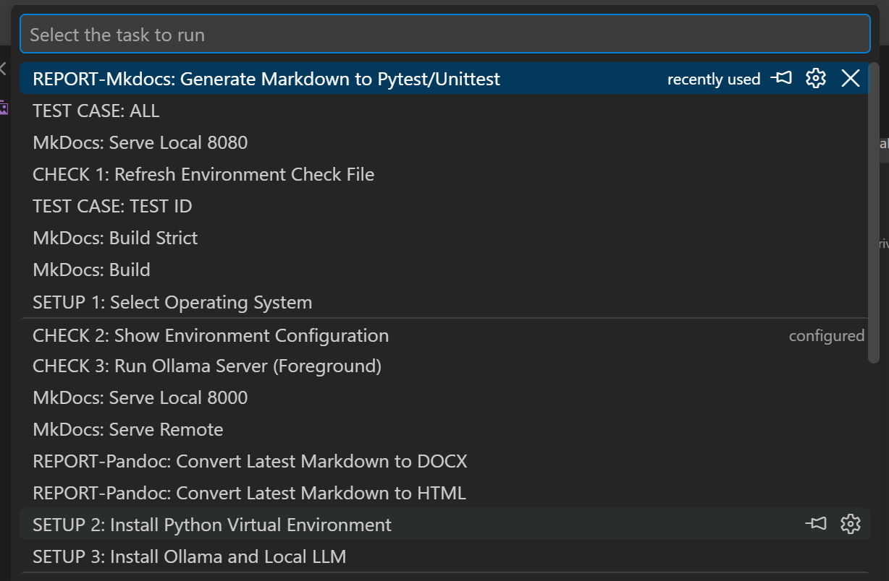
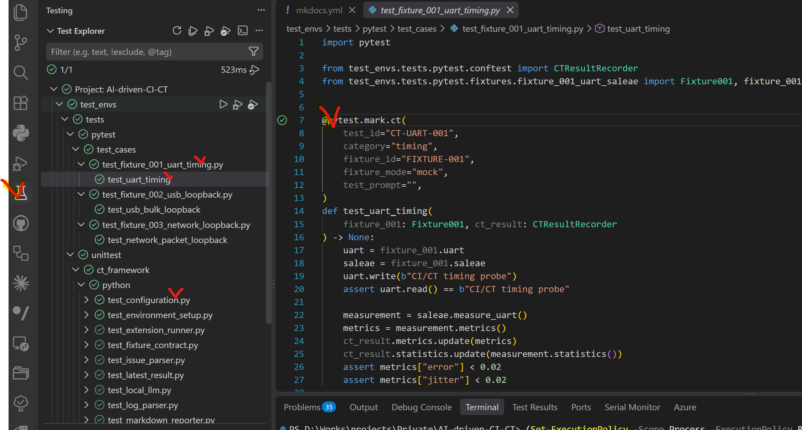
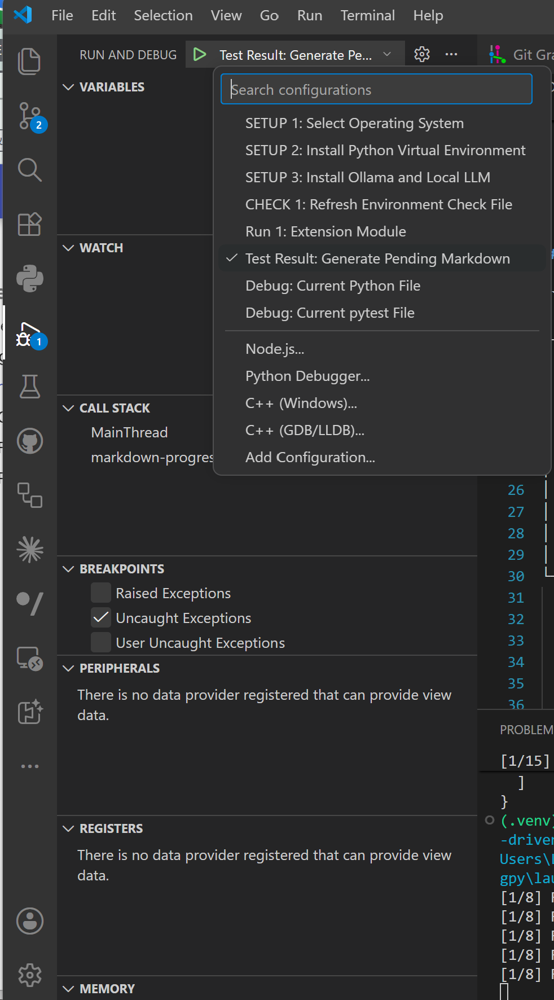
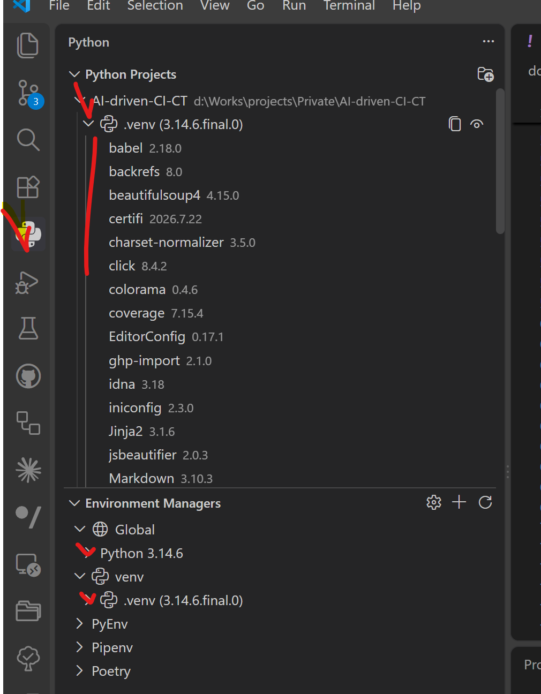

# VS Code Environment

## VS Code Files

```text
.vscode/
├── settings.json
├── launch.json
└── tasks.json
```

| File | Function |
|---|---|
| `settings.json` | Interpreter, Testing adapter, discovery scope, analysis path |
| `launch.json` | [Run and Debug](#run-and-debug) configurations |
| `tasks.json` | [Tasks](#tasks) configurations |

### settings.json

```json
{
  "python.defaultInterpreterPath": "${workspaceFolder}/.venv/Scripts/python.exe",
  "python.terminal.activateEnvironment": true,
  "python.testing.pytestEnabled": true,
  "python.testing.unittestEnabled": false,
  "python.testing.pytestArgs": [
    "-p",
    "no:cacheprovider",
    "test_envs/tests/pytest",
    "test_envs/tests/unittest"
  ],
  "python.testing.cwd": "${workspaceFolder}",
  "python.testing.autoTestDiscoverOnSaveEnabled": true,
  "python.analysis.extraPaths": [
    "${workspaceFolder}"
  ]
}
```

| Setting | Value | Function | Effect |
|---|---|---|---|
| `python.defaultInterpreterPath` | Project `.venv` | Python runtime selection | Testing, Debug, Terminal use project packages |
| `python.terminal.activateEnvironment` | `true` | Terminal venv activation | New Python terminal activates `.venv` |
| `python.testing.pytestEnabled` | `true` | pytest adapter enablement | Testing panel uses pytest |
| `python.testing.unittestEnabled` | `false` | Native unittest adapter disablement | Duplicate unittest nodes prevented |
| `python.testing.pytestArgs` | Options + paths | Discovery and execution scope | pytest and unittest share one test tree |
| `python.testing.cwd` | Workspace root | pytest working directory | `test_envs.*` imports resolve from root |
| `python.testing.autoTestDiscoverOnSaveEnabled` | `true` | Automatic rediscovery | Saved test files update the tree |
| `python.analysis.extraPaths` | Workspace root | Pylance import path | Editor resolves `test_envs.*` imports |

| `pytestArgs` entry | Function |
|---|---|
| `-p` | pytest plugin option |
| `no:cacheprovider` | Disable `.pytest_cache` provider |
| `test_envs/tests/pytest` | Discover Continuous Test cases |
| `test_envs/tests/unittest` | Discover `unittest.TestCase` through pytest |


## Tasks

<br/>



<br/>

| Group | Label | Function |
|---|---|---|
| SETUP | `SETUP 1: Select Operating System` | Store selected OS |
| SETUP | `SETUP 2: Install Python Virtual Environment` | Create project `.venv` |
| SETUP | `SETUP 3: Install Ollama and Local LLM` | Install runtime and model |
| CHECK | `CHECK 1: Refresh Environment Check File` | Regenerate environment inventory |
| CHECK | `CHECK 2: Show Environment Configuration` | Print project configuration |
| CHECK | `CHECK 3: Run Ollama Server (Foreground)` | Own Ollama foreground lifecycle |
| TEST CASE | `TEST CASE: ALL` | Execute all pytest CT cases |
| TEST CASE | `TEST CASE: TEST ID` | Execute selected TEST ID |
| REPORT | `REPORT: Generate Pending Markdown` | Process missing Execution documents |
| REPORT | `REPORT: Convert Latest Markdown to HTML` | Convert latest Markdown to HTML |
| REPORT | `REPORT: Convert Latest Markdown to DOCX` | Convert latest Markdown to DOCX |
| MkDocs | `MkDocs: Serve Locally` | Local documentation server |
| MkDocs | `MkDocs: Serve on Network` | Network documentation server |
| MkDocs | `MkDocs: Build` | Static site build |
| MkDocs | `MkDocs: Build Strict` | Warning-as-error static build |

### Process lifecycle

| Rule | Value | Function |
|---|---|---|
| Task type | `process` | Direct child-process ownership |
| Background flag | None | Prevent orphan background tasks |
| Ollama server | Foreground | Terminal owns server lifetime |
| Setup/Check launch | `preLaunchTask` | Delegate mutation to Task |
| OS metadata in Task/Launch | Prohibited | Centralize OS selection in config |

### Inputs

| ID | Options | Function |
|---|---|---|
| `testCaseId` | UART, USB, Network TEST IDs | Select one CT test case |
| `fixtureMode` | `marker`, `mock`, `hil` | Select effective Fixture mode |

### Reports

| Item | Value | Function |
|---|---|---|
| Pending command | `python -m test_envs.tools.test_result --pending --docs` | Generate missing Execution documents |
| Progress interval | 1 second | Display active report-processing duration |
| HTML | Pandoc | Convert latest Markdown to HTML |
| DOCX | Pandoc | Convert latest Markdown to Word |


## Testing

<br/>




<br/>

| Image | Function |
|---|---|
| `vscode_testing_00.png` | Testing tree, Run/Debug controls, test status |

### Adapter

| Component | Role | Input | Output |
|---|---|---|---|
| VS Code Testing panel | Test tree and controls | Adapter discovery result | Run/Debug status |
| Microsoft Python extension | VS Code–pytest integration | `settings.json` | pytest process |
| pytest adapter | Single project adapter | `python.testing.pytestArgs` | pytest + unittest nodes |
| pytest collector | Python test discovery | `test_*.py` | Modules, classes, functions |
| pytest CT hook | CT result normalization | `@pytest.mark.ct` | TEST ID Result JSON + Test log |
| unittest hook | Function result normalization | pytest reports under `tests/unittest` | Execution Result JSON + Result log |

| Adapter rule | Function |
|---|---|
| pytest adapter enabled | Unified pytest and unittest execution |
| Native unittest adapter disabled | Duplicate discovery and execution prevention |
| Project `.venv` interpreter | Same dependencies for discover, run, debug |
| Workspace `cwd` | Repository package import resolution |

### Discovery

```text
settings.json load
      ↓
Project interpreter selection
      ↓
Workspace cwd selection
      ↓
pytest discovery with pytestArgs
├── test_envs/tests/pytest
└── test_envs/tests/unittest
      ↓
Testing tree update
```

| Discovery function | Trigger | Action | Result |
|---|---|---|---|
| Initial discovery | Workspace open | Load settings and collect tests | Full Testing tree |
| Automatic discovery | Test file save | Recollect affected files | Updated nodes |
| Manual discovery | Refresh Tests | Full pytest collection | Rebuilt tree |
| Configuration discovery | Testing setting change | Restart adapter | New discovery scope |

| Test tree node | Source | Function |
|---|---|---|
| Folder | Test directory | Group modules |
| Module | `test_*.py` | Group classes/functions |
| Class | `unittest.TestCase` or pytest class | Group test methods |
| Function | `test_*` function/method | Executable test node |

| Discovery failure | Check | Recovery |
|---|---|---|
| No tests found | `python.testing.pytestArgs` | Correct test paths |
| Import error | Interpreter + `extraPaths` | Select `.venv`, verify workspace root |
| `.venv` missing | `python.defaultInterpreterPath` | Run Setup 2 |
| Duplicate unittest nodes | `unittestEnabled` | Set `false` |
| Cache path warning | pytest cache provider | Use `-p no:cacheprovider` |

### Pytest execution

| Item | Rule | Function |
|---|---|---|
| Identification | TEST ID | Identify CT test case |
| Fixture | `fixture_id` | Select composite Fixture |
| Default mode | Marker `fixture_mode` | Select default Mock/HIL mode |
| CLI override | `--fixture-mode` | Override marker mode |
| Result | `<execution-id>_result.json` | Structured test result |
| Log | `<execution-id>_test.log` | Combined test/interface/equipment log |

### Unittest execution

| Item | Rule | Function |
|---|---|---|
| Identification | Function name | Identify unit-test function |
| TEST ID | Not used | pytest-only identifier excluded |
| Fixture mode | Not used | pytest CT mode excluded |
| Result capture | unittest `conftest.py` | Collect function reports |
| Result | `<execution-id>_result.json` | Function status list and summary |
| Log | `<execution-id>_result.log` | Function status and failure detail |
| Local LLM | Not used | Direct Markdown conversion |

### Testing actions

| Action | Scope | Function | Result |
|---|---|---|---|
| Run All Tests | pytest + unittest | Execute every discovered node | Framework Result files |
| Run Tests in Folder | Selected folder | Execute directory subtree | Scoped execution result |
| Run Test | Selected node | Execute module/class/function | Single scoped execution |
| Debug Test | Selected node | Execute with debugger | Breakpoints, variables, call stack |
| Refresh Tests | Workspace | Rerun discovery | Updated Testing tree |
| Show Test Output | Latest run | Open Python Test Log | Collection/execution diagnostics |
| Cancel Test Run | Active run | Stop pytest process | Interrupted execution |

### Result flow

```text
Testing Run
├── pytest
│   ├── TEST ID Result JSON
│   └── Test log
└── unittest
    ├── Function Result JSON
    └── Result log
         ↓
REPORT: Generate Pending Markdown
         ↓
docs/tests/{pytest,unittest}
```

### Related documents

| Scope | Document |
|---|---|
| Pytest operation | [pytest_operation.md](pytest_operation.md) |
| Unittest operation | [unittest_operation.md](unittest_operation.md) |
| Pytest results | [tests/pytest/index.md](tests/pytest/index.md) |
| Unittest results | [tests/unittest/index.md](tests/unittest/index.md) |

## Run and Debug

<br/>



<br/>

| Image | Function |
|---|---|
| `vscode_runanddebug_00.png` | Launch configuration selection and debugger start |

| Configuration | Interpreter | Function | Output |
|---|---|---|---|
| `SETUP 1: Select Operating System` | System Python | Select config OS before venv | Updated `config.json` |
| `SETUP 2: Install Python Virtual Environment` | System Python | Create `.venv` and dependencies | Project Python runtime |
| `SETUP 3: Install Ollama and Local LLM` | Project Python | Install Ollama and pull selected model | Local LLM runtime |
| `CHECK 1: Refresh Environment Check File` | Project Python | Inspect OS, Python, Ollama, models | Updated `check.json` |
| `Run 1: Extension Module` | Project Python | Execute extension entry point | Extension output |
| `Test Result: Generate Pending Markdown` | Project Python | Convert pending Results | Markdown + MkDocs documents |
| `Debug: Current Python File` | Project Python | Debug open Python file | Terminal + debugger |
| `Debug: Current pytest File` | Project Python | Debug open pytest file | Fixture-mode debugging |


## Python

<br/>

